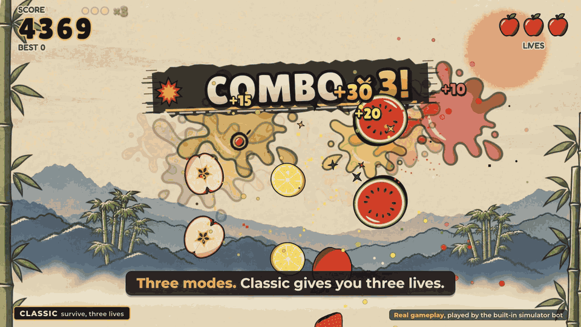
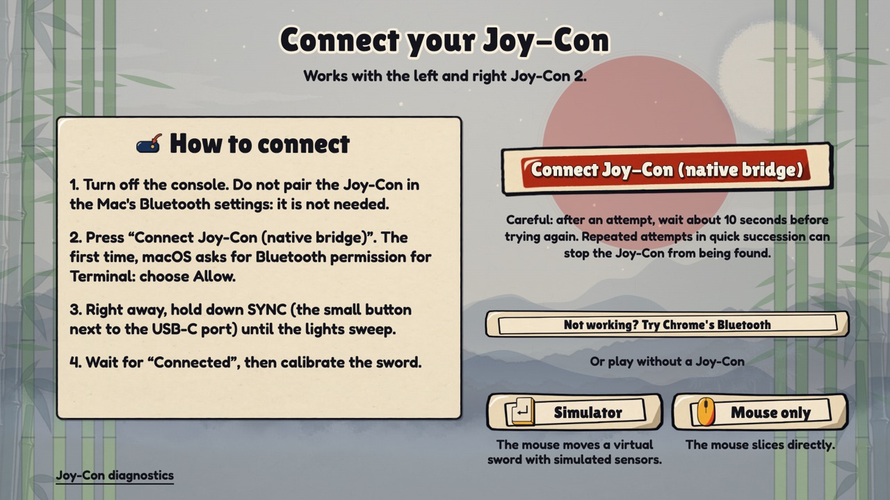
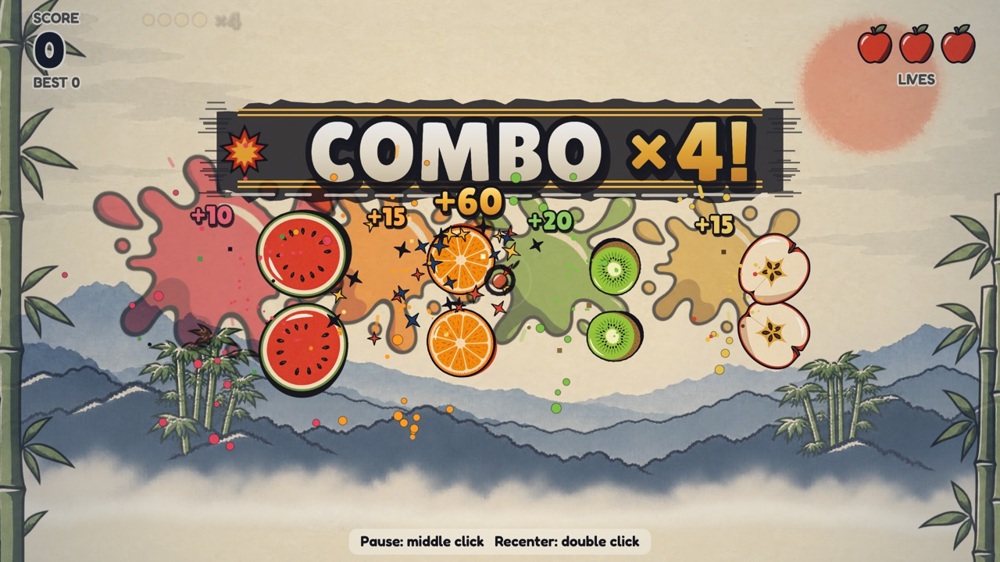
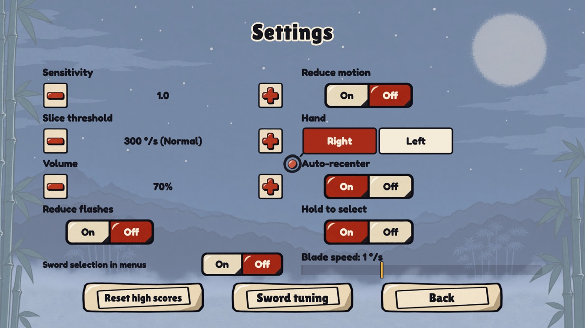

# 3D Fruit Dojo

[](https://github.com/collecticraft-sudo/3d-fruit-dojo/actions/workflows/test.yml)




*Eight seconds of real gameplay from the presentation video (Classic and Arcade), played by the built-in simulator bot: no controller and no real sword in this clip.*

**Slice fruit by swinging a real sword.** 3D Fruit Dojo is a fruit-slicing game where **your 3D-printed sword is the controller**: strap a Nintendo Switch 2 **Joy-Con 2** (left or right) to the sword, swing it, and the fruit on your Mac's screen gets cut. It is a dependency-free web game (HTML5 Canvas 2D, ES modules, a small Node server and a native Bluetooth helper for macOS) with a mouse and a simulator mode, so you can play it without any controller.

**Watch the presentation video (46 s, 1080p MP4):** download `3d-fruit-dojo-presentation.mp4` from the [v1.0.0 release](https://github.com/collecticraft-sudo/3d-fruit-dojo/releases/tag/v1.0.0) (the video is not stored in git, see `video/` for its sources and plan). The gameplay in it is the real game played by the simulator bot; it makes no claim about how the real sword feels.

*The game was renamed from "Joy-Con Ninja" on 2026-09-30. The code name `joycon-ninja` stays in the folder, in the package name, in `window.__ninja`, in the URL flags and in the browser's `joyconNinja.*` storage keys, so that your saved scores and settings survive.*

## Features

- **Three modes**: Classic (three lives, survive), Arcade (60-second score sprint with bonuses and bombs) and Zen (90 calm seconds, no bombs). Combos, a Golden Apple, four power-ups (Freeze, Frenzy, Double, Clock), ranks from Apprentice to Legend, best scores saved in the browser.
- **A real sword as the controller**: a relative gyro pointer (dead zone, acceleration curve, idle auto-centre) and a cut decision in degrees per second, both tuned on a recording of a real Joy-Con 2 Right (`docs/motion-findings.md`). Larger, proportional hit areas for fruit; bombs stay strict.
- **Native Bluetooth bridge for macOS** (`bridge/`, Objective-C, built with `clang`): the only way the Joy-Con 2 connected on the development Mac. The page talks to the game's own local server, the server talks to the controller. Chrome's Web Bluetooth is kept as a second path, and a simulator and a mouse mode work with no hardware.
- **Menus you can use on a sword**: the stick moves the choice, A confirms, B goes back; the sword selects nothing in menus unless you turn that on.
- **Spectacular, tasteful effects**: ink-brush screen wipes, juice splashes that stain the backdrop, hit-stop and slow motion on combos, bomb shockwaves, animated menus and results, richer synthesised audio (no audio files at all).
- **AI-generated art in a woodblock-print style** (Higgsfield GPT Image 2.5): sprites, three-layer parallax backdrops, a UI kit, and two open fonts (Lilita One, Fredoka). Every picture, font and sound is optional: a complete paper-and-ink fallback takes over (`?assets=0`).
- **Offline, zero runtime dependencies**, 60 fps design target, deterministic game logic with a seeded random generator and a manual clock, so bots can play and tests can replay.
- **A large automated test suite** (Node's built-in runner only): protocol parser, a fake Bluetooth stack, a fake bridge helper, a replay of the real recording, golden digests of every screen, and headless-Chrome end-to-end tests.

## Honest status

Nobody on the AI side could touch a real Joy-Con 2, and only the owner could. In short:

- **Verified on one real Joy-Con 2 Right (the owner's):** it connects through the native bridge and streams at a steady 33 Hz; the accelerometer and gyro scales; sensor bias and noise; the resting centre of the analog stick (it sits below the nominal centre, so the game estimates it per session). The owner tried the game and said it is great, and the hit boxes, the sensitivity, the fonts and the effects were changed after that feedback. That feedback is not a measurement.
- **UNVERIFIED-ON-HARDWARE:** how the sword feels after those changes, the real delay from swing to screen, the Left Joy-Con, the full travel of the analog stick (only the resting centre was measured), audio by ear, whether A and B can be reached on a sword, rumble, Chrome's Web Bluetooth path, and the frame rate on a real display. Every such item is tagged in the code and the documents, and `docs/GUIDE.md` has a 10-minute hardware checklist to settle them.
- All performance numbers come from headless Chrome on the development Mac and say nothing about your hardware.

The long version is below and in [`docs/FINAL-STATUS.md`](docs/FINAL-STATUS.md).

## Quick start (macOS)

```bash
git clone https://github.com/collecticraft-sudo/3d-fruit-dojo.git
cd 3d-fruit-dojo
./start.command        # or: npm start, then open http://localhost:8137
```

You need Node.js 22 or newer. For a real Joy-Con 2 you also need Apple's Command Line Tools (`xcode-select --install`), because the Bluetooth helper is compiled once with `clang`. Without a controller, choose "Simulator" or "Mouse only" on the connect screen, or open `http://localhost:8137/?input=sim`. The whole story (requirements, connection guide, calibration, settings, troubleshooting) is in sections 1 to 8 below.

> **Hardware honesty (final status 2026-10-01, details in [`docs/FINAL-STATUS.md`](docs/FINAL-STATUS.md)).** Nobody on the team could touch a real Joy-Con 2; only the owner could, so only what the owner's real runs showed counts as observed. **Observed on one Joy-Con 2 Right:** it connects through the native Bluetooth bridge and streams; the report rate is a steady 33 Hz (a recording of 4744 reports over 142 s); the accelerometer scale (raw / 4096 = g) and the gyro scale (0.06104 degrees per second per unit, within what a hand-timed test shows) are right; gyro bias and noise are small; the analog stick rests below the nominal centre, so the game estimates that centre per session (`docs/hardware-findings.md`). The owner played the game with the real Joy-Con 2 and gave feedback (hit boxes too small, controls too sensitive, fonts bad, effects not spectacular), and each of those was changed; that feedback is not a measurement. **Not observed, so UNVERIFIED-ON-HARDWARE:** how the sword feels after those changes, the real delay from sword to screen, the Left Joy-Con, the full travel of the stick, the sound by ear, whether A and B can be reached on the sword, Chrome's Web Bluetooth (Chrome's own list showed no device on the owner's Mac, cause unknown: that is why the game connects through the native bridge), and the frame rate on the owner's own display. Every such item is tagged **UNVERIFIED-ON-HARDWARE** in the code and in the documents; the one list is in [`docs/FINAL-STATUS.md`](docs/FINAL-STATUS.md#unverified-on-hardware-the-one-list), and the [HARDWARE CHECKLIST](docs/GUIDE.md#11-hardware-checklist) in the guide is a 10-minute first-run test that turns the open items into facts.

## Contents

1. [What you need](#1-what-you-need)
2. [Start the game](#2-start-the-game)
3. [Playing with the real Joy-Con: the short path](#3-playing-with-the-real-joy-con-the-short-path)
4. [How to play](#4-how-to-play)
5. [The three modes](#5-the-three-modes)
6. [Settings](#6-settings)
7. [Safety](#7-safety)
8. [Quick troubleshooting](#8-quick-troubleshooting)
9. [For developers](#9-for-developers)
10. [How the project was made](#10-how-the-project-was-made)
11. [Credits](#11-credits)
12. [Licences](#12-licences)
13. [Trademarks and AI disclosure](#13-trademarks-and-ai-disclosure)

The full setup, calibration and troubleshooting guide is [`docs/GUIDE.md`](docs/GUIDE.md).

## 1. What you need

| Item | Needed |
|---|---|
| Mac | Any Mac with Bluetooth. Developed on macOS 26 with Apple's N1 Bluetooth chip. |
| Browser | **Any modern browser with the native Bluetooth bridge** (the recommended path: the page talks to your own Mac's local server, which talks to the Joy-Con). **Google Chrome** only for the second path, Web Bluetooth (not Safari, not Firefox). `start.command` opens Chrome; developed against Chrome 154. |
| Node.js | Version 22 or newer (developed on 24). Install it once with Homebrew: `brew install node`. |
| Command Line Tools | Needed once to compile the bridge (`clang`): run `xcode-select --install` in Terminal. Without them the game still starts and works with the mouse and the simulator. `start.command` compiles the bridge itself (a few seconds the first time, nothing afterwards). |
| Joy-Con | A Nintendo Switch 2 **Joy-Con 2**, left or right. It is optional: the simulator and the mouse work without it. The original Switch Joy-Con is a different controller and is not supported. |
| Address | Always `http://localhost:8137`. The bridge only answers pages from that address, and Chrome allows Web Bluetooth only on secure pages (`localhost` counts as secure). Never use your Mac's network address. |

## 2. Start the game

### The easy way: double-click

Double-click **`start.command`** in Finder. A Terminal window opens (leave it open while you play), the bridge is compiled if needed, the game starts, and Google Chrome opens on it. To quit, press `Ctrl+C` in the Terminal window (or just close it).

**Always start the game from `start.command` (from Terminal).** macOS gives the Bluetooth permission to the app that started the program: the first time you connect a Joy-Con, macOS asks "Terminal would like to use Bluetooth": choose **Allow**. If you chose Don't Allow, open System Settings > Privacy & Security > Bluetooth and switch Terminal on. A game started from any other app (for example an editor's or an assistant's own window) is stopped by macOS at the first Bluetooth use, and the game then says so and tells you to restart it with `start.command`. Whether the permission really goes to Terminal this way is UNVERIFIED-ON-HARDWARE (UOH-21).

If macOS refuses to open the file because it came from the internet, right-click it and choose Open, or release it once from Terminal:

```bash
cd path/to/joycon-ninja
chmod +x start.command
xattr -d com.apple.quarantine start.command   # may print "No such xattr": that is fine
```

While its window is open, `start.command` also keeps your Mac's display awake, because a Joy-Con is not a keyboard or a mouse and macOS would otherwise dim the screen in the middle of a game. It only asks macOS not to sleep the display (it changes no setting, and stops when you close the window). To turn that off, start it with `JOYCON_NO_CAFFEINATE=1 ./start.command`. Whether the display really stays awake on your Mac is UNVERIFIED-ON-HARDWARE.

### Without the launcher

```bash
cd path/to/joycon-ninja
npm start
```

Then open `http://localhost:8137` in any browser. Press `Ctrl+C` in Terminal to stop. The bridge is built by `start.command`; without it run `npm run build:bridge` once (it starts the helper itself on the first connect if it has to compile it). `JOYCON_NO_BRIDGE=1 ./start.command` skips the build.

### What you will see

1. The **safety screen** "Before you play". Its button is locked for 2 seconds so you read it. Then press Enter or click "Got it, let's go". You see it once; the game remembers that you agreed.
2. The **connect screen** "Connect your Joy-Con", where you choose how to play. The big button **"Connect Joy-Con (native bridge)"** is the recommended way and is what Enter presses; "Not working? Try Chrome's Bluetooth" is the second path.
3. The **menu**: move the highlight with the stick (or the arrow keys) and press A (Enter) to choose a mode; with the simulator or the mouse you can also cut a fruit or click.



*The screens of a connection attempt, phase by phase, are in [the guide](docs/GUIDE.md#53-connecting-with-the-native-bridge-step-by-step).*

### Try it without a Joy-Con first

On the connect screen click "Simulator" (the mouse moves a virtual sword) or "Mouse only" (the mouse pointer cuts directly). You can also skip the screen by opening `http://localhost:8137/?input=sim` or `http://localhost:8137/?input=mouse`. It is the best way to learn the screens before you hold a sword.

### If something is in the way

| Problem | Fix |
|---|---|
| `start.command` says Node.js was not found | Run `brew install node`, then double-click again. |
| It says Node is too old | Run `brew upgrade node`. |
| Port 8137 is already used by another program | Start on another port with `PORT=8200 node server.js` and open `http://localhost:8200`. (If the program on the port is another copy of 3D Fruit Dojo, the launcher simply reuses it.) |
| The page is blank or says the browser is not supported | Use Google Chrome and the address `http://localhost:8137`. |

## 3. Playing with the real Joy-Con: the short path

The whole procedure is explained step by step in [`docs/GUIDE.md`](docs/GUIDE.md). In short:

1. **Strap** the Joy-Con firmly to the sword (any way that does not wobble; the game works out how it sits). Keep strong magnets away from it.
2. **Start** the game (`start.command`) and accept the safety screen.
3. **Connect**: press **"Connect Joy-Con (native bridge)"** (or Enter), then hold the Joy-Con's **SYNC** button (the small button next to the USB-C port) until its lights sweep. The screen tells you each step ("Looking for the Joy-Con.", "Joy-Con found. Connecting…", "Preparing the Joy-Con…") and counts the 45 seconds of the search down; "Cancel" gives up at no cost. Never pair it in the macOS Bluetooth settings. **Plan B, only if the bridge cannot be used:** "Not working? Try Chrome's Bluetooth" opens Chrome's own device list (and, after a closed list, **"Can't see it? Extended search"**).
4. **Verify** the sensor once on the diagnostics page (`http://localhost:8137/diagnostics.html`).
5. **Calibrate**: four short screens ("Hold it still", "Point at the screen", "Center the crosshair", "Try a slash"), about 20 seconds.
6. **Tune** the feel in "Settings", then "Sword tuning", and play.

### Calibration

Calibration tells the game how the Joy-Con sits on your sword. It takes about 20 seconds and has four screens: "Hold it still" (the sword rests on something, so the game can measure the sensor's own bias), "Point at the screen" (the direction you aim), "Center the crosshair" (where the middle of the screen is) and "Try a slash". It runs after you connect, and again from the menu button "Recalibrate". It is not remembered between sessions, because a different grip needs a new one; "Just recenter" is the quick option within a session. The pictures and the details are in [the guide](docs/GUIDE.md), and the pointer maths is in `docs/motion-contract.md`.

## 4. How to play

### Aiming and cutting

**How your sword turns** moves a cursor on the screen, like a mouse: turn left and the cursor goes left, raise the tip and it goes up. Holding the sword still moves nothing, and the faster you turn, the further the cursor travels per degree, so slow turns aim precisely and a fast slash crosses the screen. Rolling the sword around its own length changes nothing, and it does not matter which way you face. The game reads this from the Joy-Con's motion sensors (mostly the gyroscope).

*Since the first real test of the sword (2026-09-30) the controls were retuned from a recording of the real Joy-Con 2 Right: the crosshair is relative (no re-centring needed after a change of posture), the cut decision is in degrees per second and independent of Sensitivity, and the defaults are Sensitivity 1.0 and 300 °/s. How it feels is still unverified: the guide has a [5-minute feel check](docs/GUIDE.md#the-5-minute-feel-check-of-the-sword-controls) for the real sword.*

A **cut only counts when the blade is moving fast**: the tip of the blade must turn faster than the cut threshold, which is **300 degrees of sword rotation per second** by default ("Normal"; "Easy" is 225 and "Hard" is 450). Aiming stays well below that and a firm slash is two or three times faster, so you can aim calmly and only a real swing cuts. A bomb can only explode from a real cut, never from a slow touch. Even a very fast swing catches every fruit on its path: the game tests the whole line between two sensor samples, so a fast swing cannot skip over a fruit.



### Menus: the stick, A and B

*Since 2026-10-01.* After the first real sword test, choosing menu items by pointing the sword (cutting or resting the cursor on a button) made it too easy to slide from one control onto another and press something by accident. **With a real Joy-Con the menus are now used like a console menu: the analog stick moves a highlighted choice (a strong double ring), A selects it, B goes back.** One flick of the stick is one move (it must return near the centre before the next one), so a long push never skips several items. On a settings row the stick **left and right change the value** (a held stick repeats after 0.45 s, then every 0.12 s), up and down move to the next row, and A flips a switch. The bottom line of every menu says it ("Stick: move   A: select   B: back"; the Left Joy-Con and the keyboard get their own words). On the **settings and sword tuning screens**, which have two columns, the shoulder button of the unit (**R** on the Right Joy-Con, **L** on the Left one) or **PageUp / PageDown** on the keyboard jumps to the other column at the same height, so "Sensitivity" to "Reduce motion" is one press, not eleven flicks (the line then reads "Stick: move   A: select   R: other column   B: back"). The arrow keys, Enter and Esc do the same on the keyboard, and a mouse click works everywhere.

The sword still works as a pointer **if you want it to**: Settings has **"Sword selection in menus"** (Off by default). Off: the sword cursor stays on screen but selects nothing in the menus (no cut, no resting). On: cutting and resting (0.9 s, ring around the cursor) select again, as before. It only applies while a real Joy-Con is connected; the simulator and the mouse keep working as they did. During a round nothing changed. The stick centre, its direction and its travel are measured or assumed from one recording: [UNVERIFIED-ON-HARDWARE](docs/GUIDE.md#11-hardware-checklist) until you do the one-minute stick check.

### Controls

Every action also has a way that needs no button, because buttons may be hard to reach on a sword (UNVERIFIED-ON-HARDWARE).

| Action | Right Joy-Con | Left Joy-Con | Keyboard | Mouse or simulator |
|---|---|---|---|---|
| Move the choice (menus) | stick | stick | arrow keys | the pointer |
| Change a value (settings row) | stick left or right | stick left or right | left or right arrow | click "-" / "+" |
| Confirm / select | A, Y or X | Down, Right or Up | Enter | click the target |
| Back / "No" | B | Left | Esc | right click |
| Pause | + | - or Capture | P | middle click |
| Re-centre the cursor | ZR | ZL | Space | double click |
| Jump to the other column (settings and sword tuning) | R | L | PageUp or PageDown | none |

Also: **M** mutes and unmutes the sound. The game **pauses by itself** when the Chrome window loses focus, when the tab is hidden, and when the Joy-Con disconnects. Sound starts after your first click or key press on the page (a Chrome rule). The HOME button, the stick clicks and the rail buttons (SL and SR) are never used: the rail is where a mount or strap touches the Joy-Con, and an accidental re-centre in the middle of a swing is the worst thing that could happen.

## 5. The three modes

You choose a mode by cutting its fruit in the menu: the watermelon "Classic", the orange "Arcade" or the pear "Zen".

| | Classic | Arcade | Zen |
|---|---|---|---|
| Goal | survive as long as you can | best score in 60 seconds | relax for 90 seconds |
| Lives | 3 (and +1 for every 25 fruit cut, never above 3) | none | none |
| A fruit falls uncut | -1 life (a 1.2 s grace period follows) | nothing | nothing |
| A bomb is cut | -1 life, ends your combo, and restarts the count towards the next extra life | -50 points and -5 seconds | there are no bombs |
| Timer | none | 60 s (bonuses add time, never above 90 s) | 90 s |
| How hard a cut is | normal threshold | normal threshold | the threshold is 20 % lower, so a lighter swing cuts |

- **Fruit** are worth 10 to 30 points, and small fruit are worth more. A **combo** is several fruit cut by one swing (each within a quarter of a second of the last): `n` fruit give `5 x n x (n - 1)` extra points, with `n` counted up to 10. Big combos trigger a slow-motion moment and a banner like "COMBO ×4!".
- **Golden Apple**: +100 points, plus +1 life in Classic or +3 seconds in Arcade.
- **Power-ups** are medallions you cut:

| Medallion | What it does |
|---|---|
| Freeze | time slows to 0.4 times for 5 seconds |
| Frenzy | 6 seconds of waves made only of fruit, no bombs |
| Double | every award counts twice for 10 seconds |
| Clock | +4 seconds (Arcade only) |

- **Juice**: particles, juice splashes that stain the background, slow motion on big moments, and sound effects that are synthesised on the fly (there are no audio files).
- **Ranks** run from Apprentice through Warrior, Ninja and Master to Legend. Your best score and best combo for each mode, your settings and the fact that you read the safety screen are stored in the browser (`localStorage`); if storage is blocked the game keeps them in memory for the session. Nothing leaves your Mac: the game never uses the network.

All the numbers are starting values in `public/js/game/config.js`. The game was never tried with a real sword, so how hard or tiring it feels is UNVERIFIED-ON-HARDWARE (HW-2, HW-3, HW-9, HW-12).

## 6. Settings

From the menu choose "Settings"; it is also in the pause panel. Changes apply at once and are remembered by the browser.



| Setting | Range | Default |
|---|---|---|
| Sensitivity (how fast the cursor travels for a given turn of the sword: about 5 pixels per degree when aiming slowly, about 14 in a fast swing, times this number) | 0.3 to 2.0 | 1.0 |
| Slice threshold (the cut threshold: how fast the blade tip must turn to cut, in degrees per second), with a live "Blade speed" meter | 100 to 700 °/s | 300 ("Normal"; "Easy" up to 250, "Hard" above 375) |
| Volume | 0 to 100 % | 70 % |
| Reduce flashes and Reduce motion | on or off | off (motion follows the Mac's own setting) |
| Hand (which hand holds the sword; it only shifts where fruit are thrown) | Right or Left | right |
| Auto-recenter (soft re-centring while the sword rests) | on or off | on |
| Hold to select (select by resting the cursor; with a real Joy-Con only when "Sword selection in menus" is on) | on or off | on |
| Sword selection in menus (a real Joy-Con selects menu items with the sword: cut, rest) | on or off | **off** |
| Reset high scores | button | clears the stored records |
| **Sword tuning** | button | opens the tuning screen |

The four switches (Reduce flashes, Reduce motion, Auto-recenter and Hold to select) show two cells, **On** and **Off**; the vermilion cell is the current choice.

"Sword tuning" is the screen for setting the feel of the real sword, in two columns: on the left the pointer (sensitivity with three presets "Relaxed" 0.6, "Standard" 1.0 and "Fast" 1.5, and a reach test with four rings in the screen corners), on the right the cut (the slice threshold with three presets "Easy" 225, "Normal" 300 and "Hard" 450, a live blade-speed bar in degrees per second, and the verdict on your last swing), and three practice fruit below. If you played an earlier version, the first menu shows one message that Sensitivity and Slice threshold were reset, because their units changed. The guide explains how to use it ([Tune sensitivity and cut threshold](docs/GUIDE.md#9-tune-sensitivity-and-cut-threshold)).

## 7. Safety

You are swinging a sword-shaped object in a room. Keep **2 metres of free space in every direction**, keep people, pets and fragile things away, never play near stairs, fix the Joy-Con firmly to the sword, **always use the wrist strap**, never touch the screen with the sword, take a 5-minute break for every 15 minutes of play, and stop if you feel pain in your wrist, arm or shoulder. Children should play only with an adult present. The game's first screen says all of this and has a "Reduce flashes" option for people sensitive to flashing effects; the game never flashes the whole screen more than once per half second. The [guide's safety section](docs/GUIDE.md#2-safety-first) has more. How comfortable your sword is to swing is UNVERIFIED-ON-HARDWARE (HW-12).

## 8. Quick troubleshooting

The guide has the [full table](docs/GUIDE.md#10-troubleshooting). The most common ones:

| Symptom | What to do |
|---|---|
| The native bridge says macOS does not allow Bluetooth ("macOS is not letting this app use Bluetooth…") | Quit the game and start it again with `start.command` from Terminal, answer **Allow** when macOS asks whether Terminal may use Bluetooth. Already refused: System Settings > Privacy & Security > Bluetooth, switch Terminal on. |
| "No Joy-Con found." | Hold SYNC (the small button next to the USB-C port) until the lights sweep, close to the Mac, right after pressing the button. Switch the console off. After many tries wait a minute: the controller refuses repeated connects. |
| "The Bluetooth bridge is not available." or a note about `xcode-select` | Run `xcode-select --install` once, then start the game again with `start.command`. Meanwhile the mouse and the simulator work, and so does Chrome's Web Bluetooth. |
| Chrome's list does not show the Joy-Con (the second path) | Hold SYNC until the lights animate, then press "Not working? Try Chrome's Bluetooth". Disconnect the Joy-Con from any console first. Close other tabs that use it (for example the diagnostics page). Still empty: close the list and press **"Can't see it? Extended search"** on the connect screen; it opens the list again with every Bluetooth device nearby, and the game remembers that this worked. Also check that Chrome may use Bluetooth in macOS System Settings > Privacy & Security > Bluetooth. Or use the native bridge. |
| "Try again in N s" on the connect button | The game makes you wait between attempts (10 seconds, and about 3 minutes after three failures in a row), because, according to community reports, a Joy-Con 2 can stop answering if you retry too fast. Wait for it. |
| The cursor sits at a screen edge, or creeps while the sword is still | A real Joy-Con has no reference direction to drift from: the cursor moves by how the blade turns, so turn back and it moves back. Rest the sword for a second and it glides home by itself; or press the re-centre button (ZR or ZL), or Space, or double-click (a press while the blade is moving fast is ignored). If it creeps while you hold still, recalibrate with the sword resting on something. The guide's [5-minute feel check](docs/GUIDE.md#the-5-minute-feel-check-of-the-sword-controls) walks through it. |
| Swings do not cut, or everything cuts | Open "Settings" or "Sword tuning" and watch the "Blade speed" meter while you aim and while you swing: the threshold (the gold mark) must be above the speed you reach while aiming and below your relaxed flick. Lower "Slice threshold" (or choose "Easy") for swings that do not cut, raise it (or choose "Hard") when aiming cuts. |
| No sound | Click once anywhere on the page or press a key, and check `M` and the volume setting. |
| Anything else | Open the guide's [troubleshooting table](docs/GUIDE.md#10-troubleshooting). |

## 9. For developers

Nothing in this section is needed to play.

### Tests

```bash
npm test                 # everything: unit, integration (Node) and end-to-end (headless Chrome)
npm run test:unit        # everything except the browser
npm run test:e2e         # only the headless-Chrome suite
```

The tests use Node's built-in test runner only (`node --test`): there are no test dependencies. Every script sets `--test-timeout=120000`, so a stuck test fails after two minutes instead of hanging; `npm test` runs five test files at a time and `npm run test:e2e` three (each end-to-end file starts its own headless Chrome and several of them measure real time, so ten Chromes at once on a busy machine made them fail at random). **In this repository** (a curated copy of the project): `npm run test:unit` runs **1977 tests with 19 skipped** and needs no Chrome (this is what the GitHub Actions workflow runs). The skipped ones are the asset-pipeline tests that rebuild `public/assets/` from the 4k backdrops and raw sheets of `design/`, and the stage-readability measurements on the backdrops: those sources are not part of the repository (the tests say so when they skip), and neither is the QA evidence folder `docs/qa`, which `test-support/e2e/qa-final.mjs` regenerates. `npm test` adds the headless-Chrome suite and needs Google Chrome. The last full run of the whole project, with every source present (final integration, 2026-10-01, development Mac, Chrome 154): `npm test` **2033 tests, 0 failed, 0 skipped, 0 todo** (about 136 seconds: the end-to-end tests run in real time); `npm run test:unit` 1974 tests; `npm run test:e2e` 59 tests. The suite had 1831 tests before the restyle round and 1199 before the art layer, so recount with `npm test`. `npm run build:assets -- --check` (a fresh build of `design/` must equal `public/assets/`; it needs the 4k sources that are not in this repository) and the English-only guard (`test/architecture/english-only.test.js`) are part of the same run. The bridge suites are listed in `docs/native-bridge.md` section 12.

| Layer | Where | What it proves |
|---|---|---|
| Contracts and architecture guards | `test/shared`, `test/architecture` | type definitions and validators agree, import boundaries hold, no external URLs, no `Math.random` or DOM in the pure modules, the documents are in English and their links work, the name "3D Fruit Dojo" is used everywhere a player reads it while the identifiers that must not change did not change |
| The art layer | `test/assets`, `test/render/art-*.test.js`, `test/ui/art-*.test.js` | the loader, the manifest and the build tool, sprites and effects drawn from stub images, the stages, the UI kit, the procedural fallback for every missing picture, and the guards that keep the art out of the game logic (see [`docs/assets-integration.md`](docs/assets-integration.md)) |
| Modules | `test/input`, `test/motion`, `test/game`, `test/render`, `test/audio`, `test/ui` | the packet parser against the shared test packets, the Bluetooth state machine against a **fake** Bluetooth stack, calibration for six mountings on both sides at three sample rates, the blade tracker, game rules and determinism, the audio recipes, the UI state machine |
| Whole app in Node | `test/app` | the real `app.js` with a fake canvas on a manual clock: every mode played to the end by a bot, bombs, combos, the simulator path, the calibration wizard, disconnects, storage failure |
| Server and launcher | `test/server` | static server security and MIME types, port handling, `start.command` with fake `open`, `caffeinate` and `sleep` |
| Native bridge | `test/bridge` | the real helper compiles without warnings and passes its self-test (it never touches Bluetooth), the build script, the server endpoints and their security rules, the provider against a fake page side, the whole chain with a **fake helper process** |
| The real recording | `test/motion/real-replay.test.js`, `test/app/real-replay-app.test.js`, `test/e2e/real-replay.test.js` | the first real Joy-Con 2 recording (`recordings/`, 4744 reports) replayed through the motion pipeline, through the whole app (Bluetooth provider, parser, `app.js`, game, UI; 60 fps frames) and into a real browser with the art on: holding still moves nothing, slow aiming never cuts (also in a live round with fruit), every one of the 21 hard strokes cuts, no tunnelling, the idle glide, posture independence, 60 fps. `node tools/replay-integrated.mjs` prints the numbers |
| End to end | `test/e2e` | headless Chrome over the DevTools protocol: every request stays on localhost, the canvas really draws, real mouse and keyboard events, letterboxing, the diagnostics page, a performance smoke test, and `native.test.js`: the real game, the real server and a fake helper that plays a virtual sword (first-run flow, every progress line, calibration, a Zen round, failure paths, a crash in the middle of a game, the diagnostics page in native mode) |

The Bluetooth and simulator tests run against **models of the protocol document**, so a green test proves the code follows the document, never that a physical Joy-Con behaves like it (UNVERIFIED-ON-HARDWARE). Chrome's real device chooser (`navigator.bluetooth.requestDevice`) cannot be automated: in headless Chrome on the development Mac even a bare `requestDevice({acceptAllDevices: true})` terminates the browser, so no test opens it. If Chrome is missing, `npm test` **fails** with a clear message. Set `CHROME_PATH` to point at a Chrome binary, `E2E_SCREENSHOTS=/some/folder` to keep screenshots, or `E2E_OPTIONAL=1` to accept a run without the browser tests (they are then reported as skipped, never as passed).

### URL flags

All flags are optional, go after `?` and are joined with `&`, for example `http://localhost:8137/?input=sim&seed=7`. Wrong values are ignored and reported in Chrome's console (they never crash the game).

| Flag | Values | Default | Effect |
|---|---|---|---|
| `input` | `native`, `joycon`, `sim`, `mouse` | connect screen | choose the control method at start: `native` = the native Bluetooth bridge and `joycon` = Web Bluetooth are created without connecting (the connect screen's click connects and offers that path first), `sim` and `mouse` connect at once. `?input=bridge` (an old reserved name) is ignored with a warning. The native path needs the real clock (not `clock=manual`) |
| `seed` | integer | random per round | fixed seed for every round (reproducible fruit) |
| `mode` | `classic`, `arcade`, `zen` | none | skip the menu and start that mode; implies `skipsafety=1` and, without `input`, `input=mouse` |
| `skipsafety` | `1` | off | skip the safety screen without remembering your agreement |
| `skipcountdown` | `1` | off | with `mode`, start playing without the 3-2-1 |
| `clock` | `manual` | real | manual clock: time moves only through `__ninja.advance(ms)` (tests and agents) |
| `debug` | `1` | off | overlay (frame rate, stage, blade speed, hit circles) and checking of every data packet against the contracts (problems go to the console) |
| `mute` | `1` | off | never create the audio context |
| `reducemotion`, `reduceflash` | `1` | off | force the accessibility settings on (not remembered) |
| `simhz` | 10 to 1000 | 66 | simulator packet rate |
| `simmount` | `faceUp`, `faceSide`, `upsideDown`, `tipFlipped`, `tilted`, `sideRail` | `faceUp` | how the virtual Joy-Con is "mounted" on the virtual sword |
| `simside` | `L`, `R` | `R` | virtual Joy-Con side |
| `simmirror` | `1` | off | mirrored gyroscope sign in the simulator |
| `simgyro` | `alt` | default | the alternative gyroscope scale (0.0075 degrees per second per unit) in the simulator |
| `simseed` | integer | 1 | simulator noise and timing-jitter seed |
| `simcal` | `1` | off | run the real calibration wizard against the simulator instead of its exact built-in calibration |
| `haptics` | `1` | off | experimental vibration on cut and bomb (UNVERIFIED-ON-HARDWARE) |
| `filter` | `lenient`, `strict`, `all` | `lenient`, or the filter that worked last time | which devices Chrome's Bluetooth list offers: `lenient` = any Joy-Con 2 by product id (the default), `strict` = only Joy-Cons whose advertisement carries the all-zero host address of pairing mode, `all` = every Bluetooth device nearby. An explicit `?filter=` beats the filter the game remembered. The connect screen's "Can't see it? Extended search" button asks for `all` by itself, and after any connection that reached the data stream the game remembers the filter it used (in memory and in the browser's localStorage under `joyconNinja.ble.v1`) |
| `mask` | `0xB7`, `0xFF`, `0x37` (always with the `0x`) | `0xB7` | which sensor fields the Joy-Con is asked to send. `0xB7` is the default, `0xFF` the last resort (it may report phantom ZL and ZR presses), `0x37` an expert choice. If a mask gives no data for 4.5 s the game falls back by itself |
| `side` | `L`, `R` | both | which Joy-Con the list offers (Web Bluetooth) or the bridge looks for |
| `accelsign` | `1`, `-1` | saved value, else `1` | sign of the accelerometer: use `-1` if the diagnostics page shows raw Z near -4096 with the buttons up (UNVERIFIED-ON-HARDWARE, UOH-20) |
| `simaccelsign` | `-1` | `1` | the simulator models a sensor that reports the opposite gravity sign (to test `accelsign`) |
| `assets` | `0`, `off` | on | turn the optional generated art off: no image and no font file is requested and the paper-and-ink drawing runs with the system fonts (see the art layer below) |
| `fonts` | `0`, `off` | on | keep the art but use the system fonts instead of the two shipped web fonts (Lilita One and Fredoka, `docs/typography.md`); implied by `assets=0` |

`mask`, `side` and `accelsign` concern the real Joy-Con on both paths; `filter` only Web Bluetooth. The diagnostics page prints the matching game address for whatever combination works on your Joy-Con (the default filter is left out of it). Whether `lenient` or `all` lists the controller in Chrome on your Mac is UNVERIFIED-ON-HARDWARE (UOH-1).

### Automation: `window.__ninja`

`window.__ninja` is always present and is what the end-to-end tests and automated agents use. Under `?clock=manual` the game moves only when you call `advance`, so a run is a pure function of the seed and the calls.

```js
await __ninja.ready;                              // boot finished
__ninja.start('classic', { seed: 1 });            // plays at once (skipCountdown defaults to true)
__ninja.advance(1000);                            // manual clock only, frames of at most 16 ms
const s = __ninja.snapshot();                     // plain JSON: screen, score, lives, objects, events, blade, provider, ...
const id = s.objects[0].id;
const r = await __ninja.swingThrough(id, { speed: 3000, angleDeg: 20 });   // r.cutCount, r.events, r.maxSpeed, ...
await __ninja.swing({ x: 300, y: 500 }, { x: 900, y: 500 }, 200);          // straight swing, samples every 4 ms
await __ninja.simSwing({ x: 300, y: 500 }, { x: 900, y: 500 }, 200);       // same, through the simulator sensor chain (?input=sim)
__ninja.debug.spawn({ kind: 'fruit', type: 'apple', apexX: 960, apexY: 540, atApex: true });
__ninja.pause(); __ninja.resume(); __ninja.press('recenter');
__ninja.reanchor(960, 540);                       // puts the (relative) cursor there at the next sensor sample; how a test places a real-Joy-Con cursor
__ninja.getMotionState(); __ninja.getCalibration(); __ninja.getUiState(); __ninja.getPerf(); __ninja.getConfig();
__ninja.getAssets();                              // status of the optional art loader and the stage: groups, states, counts (plain data)
```

`swing` and `swingThrough` go through the real blade tracker (the aim path, where the threshold is 300 °/s = 1000 pixels per second): a swing below the cut threshold never cuts. A real Joy-Con is tested with the recording instead (below). The full list is in `docs/architecture.md` section 9.8, and later additions are in `docs/contract-notes.md`.

### Performance

The design targets are 60 fps at 1080p, game physics in fixed steps of 1/120 s, a swept-segment collision test (a fast swing never tunnels through a fruit) and less than 50 ms from sensor to screen. All the numbers below were measured on the development Mac in headless Chrome 154 at 1920x1080 with the simulator, the generated art and the two web fonts loaded, on 2026-10-01, with other work running on the same machine (a software rasteriser: they say nothing about your GPU or display). `test/e2e/perf.test.js` plays 20 seconds of Classic in real time; `node test-support/e2e/qa-final.mjs` (evidence in `docs/qa/final/`) plays all three modes with a bot and measures the heaviest scene.

| Measure | Value |
|---|---|
| Frame interval, real clock, a Classic round with a bot (`test/e2e/perf.test.js`, 1251 frames) | 16.7 ms (60.0 fps), p99 16.8 ms, no long tasks |
| JavaScript cost of one frame (game step plus drawing), the same run | 0.41 ms on average, p95 0.70 ms, p99 1.30 ms, worst 6.5 ms |
| Heaviest scene I could build: Arcade, Frenzy running, waves on, a bot cutting 4 fruit every 24 frames (1321 frames, manual clock, the final QA run (`node test-support/e2e/qa-final.mjs`)) | 0.53 ms on average, p50 0.20 ms, p95 0.5 ms, p99 7.9 ms, worst 82 ms (see the note below) |
| Same Classic run with `?assets=0` (painted) | about 0.33 ms per frame |
| JavaScript heap | about 7 MB in the menu, about 15 MB after 22 seconds of the heaviest scene (not a leak test: `test/game/soak.test.js` and `test/ui/soak.test.js` check the pools) |
| Input to draw (software only) | about 9 to 10 ms |

Note on the worst frame: in the heaviest scene a few single frames took 30 to 80 ms in the FIRST page of a fresh Chrome, none in the next two pages (one frame of 14 ms): the cause was not isolated (a first-time bake, garbage collection or the other work on the machine are all possible), the real-clock run above had no long task, and a single hitch of that size is what the "UNVERIFIED-ON-HARDWARE" frame-rate item of the checklist is for.

These numbers describe headless Chrome on the development machine. They say nothing about your MacBook's display, and nothing about the Bluetooth part of the delay. The 60 fps and 50 ms targets on your hardware are UNVERIFIED-ON-HARDWARE (HW-1, UOH-18).

### The art layer (optional generated pictures)

The look of the game has two layers. The first is the **procedural drawing**: everything is drawn with canvas paths, gradients and one seeded texture, with no image file at all. It is complete, it is the fallback, and it is what the automated tests exercise first. The second is the **generated art** in `public/assets/`: sprites for the ten fruit and the Golden Apple (whole and halves), the bomb and the four medallions, juice splashes, a bomb explosion, a slice flash, a blade brush, icons, glyphs (the two Joy-Con pictures are shipped but switched off in `art-config.js` until a neutral replacement exists), the UI kit (buttons, steppers, switches, panel, timer ring, cursors, logo) and three-layer backdrops for four stages (Classic, Arcade, Zen and the night stage of the menus). The pictures were generated from `design/higgsfield-brief.md`; `design/assets.csv` lists every asset and where it came from, and `public/assets/PROVENANCE.csv` ties every shipped file to its source.

- **Optional, per picture.** Every picture is looked up first; a missing file, a failed decode, a timeout or a not-yet-loaded group means that object is drawn procedurally, in the same frame, with no gap. `?assets=0` (or `off`) skips the art altogether.
- **A skin, never game state.** Collision radii, hit boxes, timings, target rectangles (84 x 84 px minimum), the 28 px minimum text size and the deterministic fixed-step game logic do not change. `game/`, `motion/`, `input/` and `shared/` never import the art modules (a guard test).
- **Cheap and lazy.** Sprites and the UI kit load at boot (the game waits at most 2.5 seconds, then goes on); backdrops load per stage on demand, at most two stages are in memory, layers ship at 2560 x 1440 pixels or smaller, scaled images are cached once per size and device-pixel step, and nothing is allocated per frame. Same-origin, no CDN.
- **Accessibility keeps working**: "Reduce flashes" shortens and dims the explosion, "Reduce motion" turns off backdrop drift, parallax and fades, and fruit stay distinguishable by silhouette.
- **Where to read more.** `docs/assets.md` describes the shipped files, the build tool (`tools/build-assets.mjs`, which writes only `public/assets/` and is never needed to run the game), the measurements and the open decisions; [`docs/assets-integration.md`](docs/assets-integration.md) is the contract that the loader, the renderer, the stages and the widgets follow; [`docs/architecture.md`](docs/architecture.md) section 8.11 and [`docs/game-design.md`](docs/game-design.md) section 11.6 give the short version.

How the art performs on your Mac (60 fps, memory, load time) was measured in headless Chrome on the development machine at best; it is UNVERIFIED-ON-HARDWARE for your display (HW-1) and `docs/assets.md` says exactly what was and was not measured. On that machine the page's renderer process holds about 190 MB more with the art than with `?assets=0` (395 against 201 MB at 2880 x 1800), and the number stays flat over many mode changes (each stage is decoded when needed and freed when it goes).

### Project layout

```
start.command               double-click launcher (macOS)
server.js                   dependency-free static server, 127.0.0.1:8137, and the /__bridge/ endpoints of the native Bluetooth bridge
bridge/                     the native Bluetooth bridge: joycon-bridge.m (CoreBluetooth helper, Objective-C), build.sh, manager.js, Info.plist
package.json                "type": "module", scripts: start, test, test:unit, test:e2e, build:bridge, build:assets
tools/                      build-assets.mjs and asset-spec.mjs (build public/assets/ from design/); record-imu.mjs, analyze-imu.mjs, analyze-motion.mjs, replay-motion.mjs (the recording of the real sensor and its analysis), replay-integrated.mjs (the recording through the whole app), verify-round-1 and verify-round-2 (the independent motion verifiers); developer tools, the game never needs them
recordings/                 imu-2026-09-30T18-42-24.jsonl: the real Joy-Con 2 Right recording (4744 reports) that the motion tests replay
design/                     what is kept of the art sources (see below); the game never reads it
  higgsfield-brief.md       the art brief and the style formula
  assets.csv                the asset list with the provenance of every picture
  sprites/ ui/ fx/ icons/   the sprite, user-interface, effect and icon sources (about 20 MB, PNG)
  fonts/                    the two font sources, their SIL OFL texts, the build script and the WOFF2 subsets
  previews/ tools/          small contact sheets and slice-sheet.mjs, alpha-extent.mjs
  (not in git: backgrounds/ 4k originals, 84 MB, and the raw generated sheets phase0/1/2, 230 MB: see LICENSE-ASSETS.md)
public/
  assets/                   the optional generated art: sprites, fx, icons, ui, backgrounds (2560 px), fonts, manifest.json, PROVENANCE.csv
  index.html                one canvas, one module script
  diagnostics.html          the Joy-Con verification page
  css/game.css
  js/
    main.js                 browser bootstrap
    app.js                  wiring: input, motion, game, presentation, frame loop
    ninja-api.js            window.__ninja
    flags.js                URL flags
    wake-lock.js            asks Chrome to keep the screen awake during a session
    shared/                 contracts, validators, clock, random numbers, playfield
    input/                  Joy-Con providers (native bridge, Web Bluetooth), simulator, mouse, packet parser, diagnostics page script
    motion/                 orientation filter, calibration wizard, blade tracker, aim mapping
    game/                   pure game rules: spawning, physics, slicing, combos, modes
    render/  audio/  ui/    canvas drawing (with assets.js, stage.js and art-config.js for the optional art), synthesised sound, screens and state machine, English strings
test/                       node --test suites
test-support/               fakes and helpers: fake Bluetooth, fake bridge helper, fake canvas, DevTools client, app harness
docs/
  GUIDE.md                  the setup, calibration and troubleshooting guide, with the HARDWARE CHECKLIST
  img/                      screenshots used by the README and the guide (taken with the simulator; test-support/e2e/guide-screens.mjs and native-screens.mjs redraw them)
  architecture.md           module contracts (the source of truth together with public/js/shared/contracts.js)
  game-design.md            game design
  joycon2-protocol.md       Joy-Con 2 protocol research and verification plan
  protocol-audit.md         independent audit of the protocol code
  FINAL-STATUS.md           the final status: tests, measured numbers, what is verified on hardware and the one UNVERIFIED-ON-HARDWARE list
  typography.md             the two web fonts, the text styles, loading and the system fallback
  hardware-findings.md      what the owner's real-hardware runs proved and did not prove (2026-09-30 and 2026-10-01)
  motion-findings.md        the analysis of the real recording and the numbers the pointer and the cut decision were tuned on
  motion-contract.md        the contract of the motion pipeline
  native-bridge.md          the native Bluetooth bridge: design, protocols, security, macOS permission, string keys, what is unverified
  assets.md                 the shipped generated art: pipeline, measurements, sizes, memory, provenance
  assets-integration.md     the contract of the art layer: loader, sprites, stages, UI kit, tests, decisions
  restyle-direction.md      the art and motion direction of the restyle round (effects catalogue, timings, audio direction)
  joycon2-test-vectors.json real and synthetic packets used by the parser tests
  contract-notes.md         log of deviations and decisions
  code-review-round-N.md, qa-report-round-N.md, motion-*-round-N.md, improvements.md   review and QA history
video/                      the plan, storyboard, scripts and HyperFrames composition sources of the presentation video (the footage, audio and the MP4 are not in git)
playbook/                   NEW-GAME-PLAYBOOK.md: what this project learned, written for an AI agent that starts the next motion-controlled game
.github/workflows/test.yml  runs npm run test:unit on every push
LICENSE  LICENSE-ASSETS.md  CREDITS.md   the MIT licence of the code, the terms of the art, video and third-party files, the credits
```

The review and QA reports were written before the rename and keep the old name Joy-Con Ninja on purpose; everything else in the documents says 3D Fruit Dojo.

Data flow for every frame: samples from the control method (Joy-Con packets, simulator packets or mouse positions) go into the motion pipeline, which produces blade positions and cut segments; the game consumes the segments in fixed 120 Hz steps; the presentation draws the interpolated state. Details: `docs/architecture.md` section 4.

### Known limitations

- Never run in Chrome (Web Bluetooth) against a real Joy-Con 2: see the [HARDWARE CHECKLIST](docs/GUIDE.md#11-hardware-checklist) and `docs/hardware-findings.md` for what native probes have and have not shown. The simulator and the fake Bluetooth stack model the protocol document.
- With the native bridge you hold SYNC at the start of every session (and after every lost link): the bridge never retries by itself, because a Joy-Con that dropped is not advertising in pairing mode any more. With Web Bluetooth Chrome asks you to choose the device from its list every session. Keep the game tab in front while you play (browsers slow hidden tabs).
- The calibration is not remembered between sessions, because a different grip needs a new one. "Just recenter" is the quick option within a session.
- A Joy-Con keeps one Bluetooth link at a time: close or disconnect the game before you use the diagnostics page and the other way round (the links between the two pages do it for you).
- A gap in the Bluetooth data does not move the cursor (a real Joy-Con points relatively, so a hole only loses the motion inside it); the game still asks for a short quick re-centre after a reconnect. The simulator keeps its absolute pointer and re-references after a hole.
- The retuned controls (relative pointer, acceleration curve, 300 °/s cut threshold, idle glide) come from ONE recording of ONE person: they are proven on that recording (`test/motion/real-replay.test.js`, `test/app/real-replay-app.test.js`, `test/e2e/real-replay.test.js`, `node tools/replay-integrated.mjs`) and nothing else. In Zen (threshold 240 °/s) the owner's most vigorous aiming cuts a little (about 2 % of the samples), which is harmless there (no bombs).
- In Classic a bomb costs one life (the "lethal bombs" option of the design is not offered in the screens).
- The native Bluetooth bridge was built and tested against a **fake helper** and the real packet captures (`test/bridge`, `test/e2e/native.test.js`); after that the owner ran the real helper against a real Joy-Con 2 Right (it connected and streamed; the recording of 4744 reports was written through it). The owner did not report on its other open items one by one (pairing preference, keep-alive over minutes, behaviour after a disconnect, the Left unit): UOH-21 to UOH-33 stay open except where `docs/FINAL-STATUS.md` says otherwise (`docs/native-bridge.md` section 11).
- Simulator only: after a manual re-centre the virtual sword snaps back to the mouse position when the pointer pauses for 200 ms and moves again, so the re-centre is undone. This is a property of the test tool (the real Joy-Con path is not affected).
- Simulator only: the simulated disconnect shows the "Joy-Con disconnected" overlay with "Try again" enabled and no waiting line; the real Bluetooth path shows "Try again in N s" greyed out, as designed.
- The game does not show that a gyroscope scale or accelerometer sign saved by the diagnostics page is being used; the diagnostics page lists them and has a button to clear them.


## 10. How the project was made

3D Fruit Dojo was built in about two days of calendar time (2026-09-30 to 2026-10-01) by one owner and a team of AI agents working with Claude:

1. **Research and contracts first.** The Joy-Con 2 Bluetooth protocol was researched from public community sources, audited by a second agent, and written down with confidence levels (`docs/joycon2-protocol.md`, `docs/protocol-audit.md`). A game design bible and an architecture document with exact contracts came before any code (`docs/game-design.md`, `docs/architecture.md`).
2. **Parallel engineers on disjoint files**, an integrator, then independent validation: a QA bot that plays the game in a real browser, visual critics, a white-box code reviewer, a protocol audit and a motion verifier that replays real recordings. Every deviation from a contract is logged in `docs/contract-notes.md`.
3. **Real data beat opinion.** The first recording of the owner's real Joy-Con 2 Right (`recordings/`) rejected four pointer designs with numbers and set the dead zone, the acceleration curve and the cut threshold in degrees per second (`docs/motion-findings.md`).
4. **Art with Higgsfield GPT Image 2.5**: one style formula approved by the owner, one sheet per subject, cut into sprites by `design/tools/slice-sheet.mjs`, three-layer backdrops, a UI kit, then a restyle round (two OFL fonts, effects, audio, transitions). The brief is `design/higgsfield-brief.md`; the provenance of every picture is `design/assets.csv`.
5. **Honesty labels everywhere.** Anything that only the physical controller can settle is tagged UNVERIFIED-ON-HARDWARE and listed in one place.

The lessons, the measured hardware facts and a plan for the next game are written down in [`playbook/NEW-GAME-PLAYBOOK.md`](playbook/NEW-GAME-PLAYBOOK.md). The presentation video's plan and sources are in [`video/PLAN.md`](video/PLAN.md).

## 11. Credits

- Game design, direction, hardware testing and the 3D-printed sword: collecticraft-sudo (the owner).
- Code, tests, documentation and the video: AI agents with Claude (Anthropic), reviewed by other agents; the owner tried the result.
- Art: Higgsfield GPT Image 2.5. Fonts: Lilita One (Juan Montoreano) and Fredoka (The Fredoka Project Authors), both SIL OFL 1.1.
- Video music: "Happy Beats / Business Moves" by Sascha Ende (ende.app), CC BY 4.0. Video sound effects: Kenney (kenney.nl), CC0.
- The community researchers of the Joy-Con 2 protocol (ndeadly, Peterksharma, JoeGeC, TheFrano, seitanmen, mascii and others).

The full list with links and the changes made to each work is in [`CREDITS.md`](CREDITS.md).

## 12. Licences

- **Code** (JavaScript, Objective-C, scripts, tests, documentation text): MIT, see [`LICENSE`](LICENSE), copyright 2026 collecticraft-sudo.
- **Art, the logo, the name and the video: all rights reserved.** You may run the game and look at the art; you may not reuse it elsewhere without written permission. See [`LICENSE-ASSETS.md`](LICENSE-ASSETS.md).
- **Third-party files**: Lilita One and Fredoka under the SIL Open Font License 1.1 (texts shipped next to the font files); the video's music under CC BY 4.0 and its sound effects under CC0. See [`LICENSE-ASSETS.md`](LICENSE-ASSETS.md) and [`CREDITS.md`](CREDITS.md).

## 13. Trademarks and AI disclosure

- **Nintendo, Nintendo Switch 2 and Joy-Con are trademarks of Nintendo. This project is not affiliated with, endorsed by or sponsored by Nintendo.** The controller pictures in the game are generic gamepad drawings. The project talks to the controller over standard Bluetooth Low Energy, using public community research.
- **AI disclosure.** The art was generated with Higgsfield GPT Image 2.5. The code, the tests, the documents and the presentation video were built and reviewed by AI agents with Claude (Anthropic), under the direction of the owner. No agent could try the real sword: what was and was not measured on hardware is stated in "Honest status" above and in `docs/FINAL-STATUS.md`.
