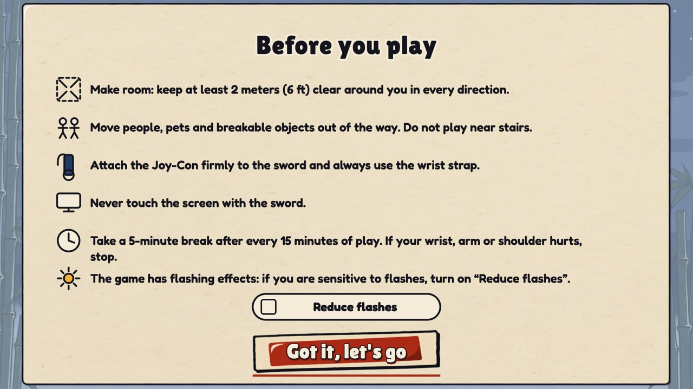
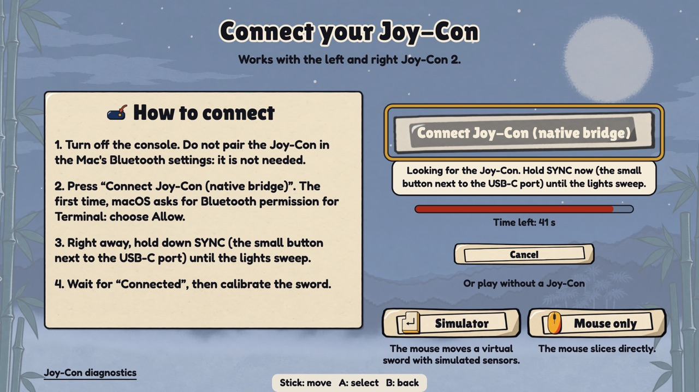
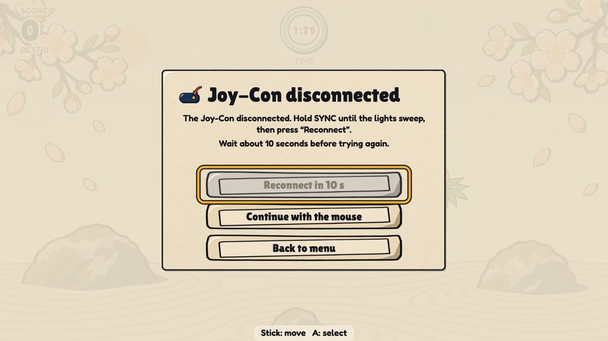
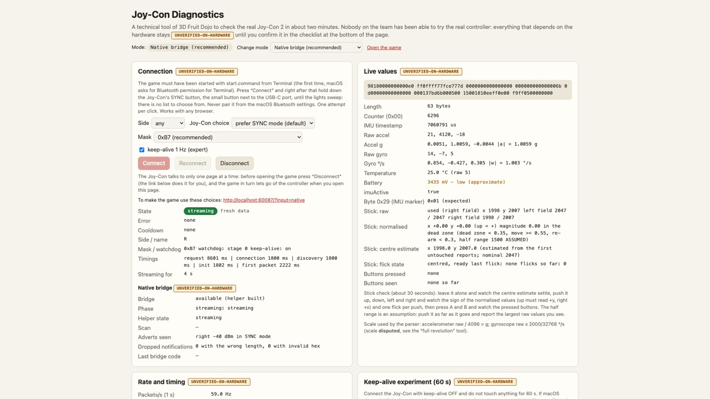
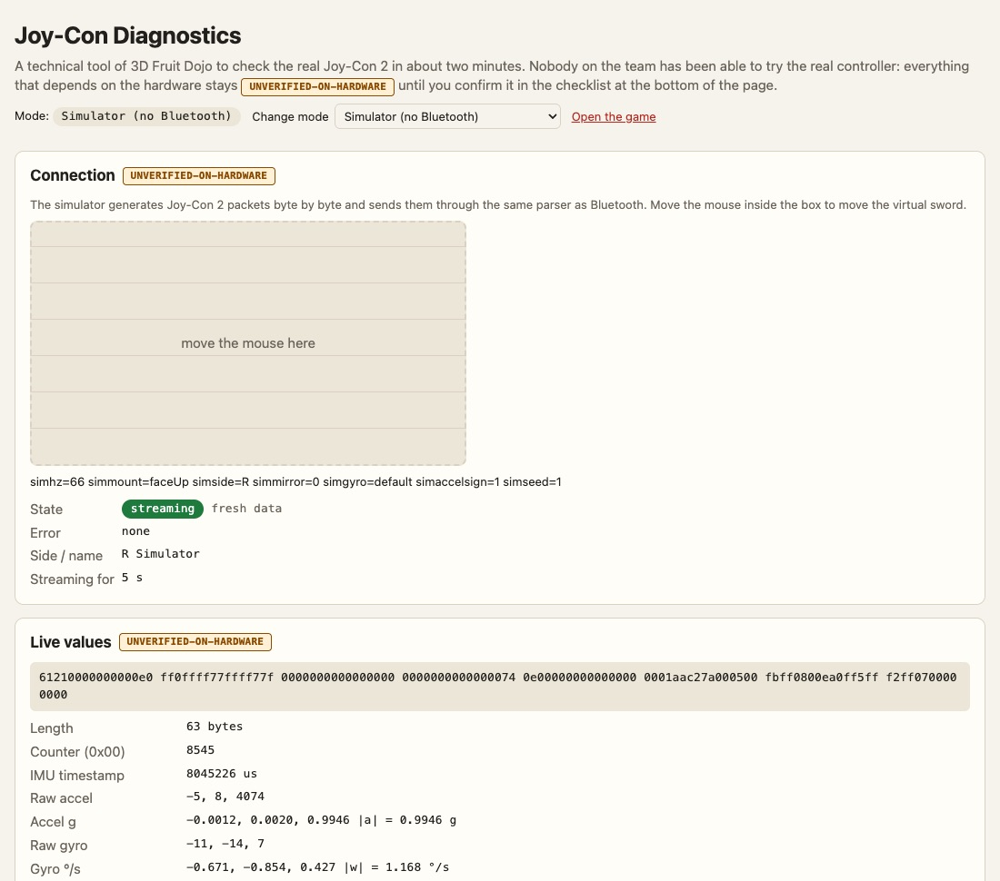
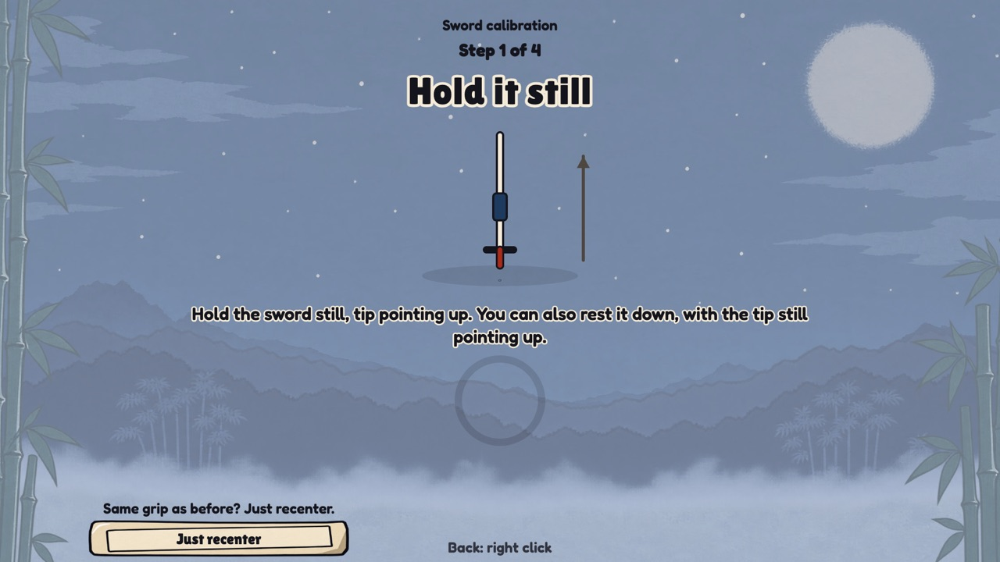
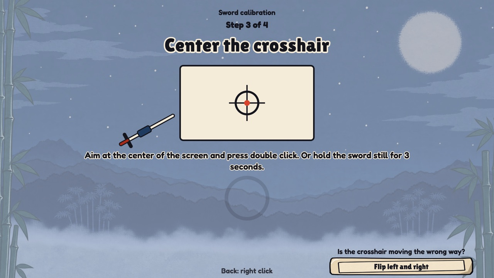
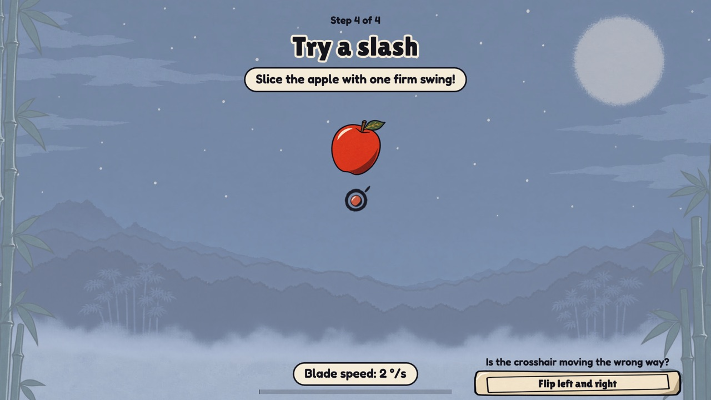
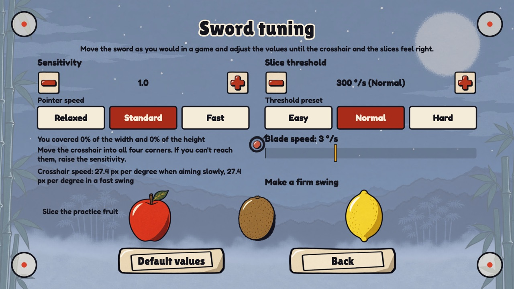

# 3D Fruit Dojo: setup and calibration guide

How to get a Nintendo Switch 2 **Joy-Con 2** (left or right) working as the blade of 3D Fruit Dojo: connect it (through the **native Bluetooth bridge**, the recommended way, or through Chrome's Web Bluetooth), strap it to the sword, verify it in two minutes, calibrate it, tune it, stay safe, fix what goes wrong, and run the 10-minute first-run test that turns the project's guesses into facts.

This guide is written for a maker, not a programmer. You will copy a few commands into the Terminal app. The ones that could be tested here were run while writing this guide (see the end of section 4 for exactly which).

**The game screens and this guide are both in English.** Whenever the guide names something you will see on the screen, it quotes the on-screen text exactly, for example "Connect Joy-Con". (The game's text was Italian until 2026-09-30, when the owner switched the whole game to English.) Section 13 explains the labels whose meaning is not obvious.

**The name.** The game is called **3D Fruit Dojo** (it was renamed from its working title "Joy-Con Ninja" on 2026-09-30). The folder and the package are still called `joycon-ninja`, and `window.__ninja`, the URL flags and the browser's `joyconNinja.*` storage keys keep that code name, so your saved scores and settings survive the rename. Older screenshots and reports that show the old title are showing the same game. The screenshots in this guide were taken with the simulator and show the game with its generated pictures; with `?assets=0` (or if the pictures cannot load) the same screens are drawn in the plainer paper-and-ink style.

**The pictures.** The game draws its fruit, buttons and backdrops with generated pictures (a flat woodblock-print look). They are optional: a complete paper-and-ink drawing of everything is built into the game and takes over, picture by picture, whenever a picture is missing, has not loaded yet or failed. [Section 4](#4-start-the-game) says what you will see; the files and how the game uses them are in [`assets-integration.md`](assets-integration.md) and `docs/assets.md`.

## Contents

0. [Read this first](#0-read-this-first)
1. [What you need](#1-what-you-need)
2. [Safety first](#2-safety-first)
3. [Mount the Joy-Con on the sword](#3-mount-the-joy-con-on-the-sword)
4. [Start the game](#4-start-the-game)
5. [Pair and connect the Joy-Con 2](#5-pair-and-connect-the-joy-con-2)
6. [Verify the sensor in two minutes](#6-verify-the-sensor-in-two-minutes)
7. [Calibrate the sword](#7-calibrate-the-sword)
8. [Re-centre during play](#8-re-centre-during-play)
9. [Tune sensitivity and cut threshold](#9-tune-sensitivity-and-cut-threshold)
10. [Troubleshooting](#10-troubleshooting)
11. [HARDWARE CHECKLIST](#11-hardware-checklist)
12. [Report your results](#12-report-your-results)
13. [What the screen labels mean](#13-what-the-screen-labels-mean)

## 0. Read this first

**Nothing here was tried on a real Joy-Con 2 by the people who built the game; the owner is the only person who touched the controller, and only what the owner's real runs showed counts as observed.** Final status (2026-10-01), in one place, in [`FINAL-STATUS.md`](FINAL-STATUS.md): the owner's Joy-Con 2 Right **connects through the native Bluetooth bridge and streams** (a first recording of 4744 reports over 142 s was written through the bridge), the **report rate is a steady 33 Hz**, the **accelerometer scale** (raw / 4096 = g) and the **gyro scale** (0.06104 degrees per second per unit, within what a hand-timed test can show) are right, the gyro bias and noise are small, and the **stick rest centre** was measured on that unit (it sits below the nominal 2047, so the game estimates it per session). The owner then played the game with the real sword and said it is great, that the hit boxes were small and the controls too sensitive; those two were fixed from the recording (hit areas 1.55 x, a relative pointer and a cut threshold in degrees per second). **Not observed on hardware** (the UNVERIFIED-ON-HARDWARE list of `FINAL-STATUS.md`): how the sword FEELS after those fixes, the real latency from sword to screen, the Left Joy-Con, the full travel of the stick, the sound by ear, whether A and B can be reached on the sword, and Chrome's Web Bluetooth (on the owner's Mac Chrome's own list showed no device with the old default filter, for a reason nobody knows; that is why the game connects through the native bridge first, the small program `bridge/joycon-bridge.m` that the game's own server starts). Everything else about the controller (how it pairs, which way its sensors point, how much it drifts, how laggy it is) comes from community research (people who reverse-engineered the Joy-Con 2 and published their notes and code) and from software models of it. Anything that only the physical device can confirm is tagged **UNVERIFIED-ON-HARDWARE** in this guide, in the code and in the other documents. The tags `UOH-n` (from `docs/joycon2-protocol.md`; UOH-21 to UOH-35 are the native bridge's and the stick's) and `HW-n` (from `docs/game-design.md`) are item numbers; `F1` to `F6` are findings of `docs/protocol-audit.md`.

The same evening the owner's first real sword test and a **first recording of the motion sensors** (one Joy-Con 2 Right, nine hand-timed steps, `docs/motion-findings.md`) showed that the first defaults were wrong for a real hand (everything cut, the crosshair kept running to the screen edge), and the sword controls were retuned from that recording: the crosshair now moves like a mouse, only a fast swing cuts, and the defaults are 300 °/s and Sensitivity 1.0 (section 9). **Whether the new controls FEEL right is still unverified: the [5-minute feel check](#the-5-minute-feel-check-of-the-sword-controls) in section 11 is how you find out.**

So read every statement about the controller's behaviour that is not in the verified list above as "according to the community notes". The guide is also the procedure that settles those statements: the [HARDWARE CHECKLIST](#11-hardware-checklist) (section 11) is a 10-minute test in which you look at specific things on screen and learn what each result means.

How long it takes: the first full setup (mounting, connecting, calibrating) is about half an hour. After that, starting a session takes about a minute: start, press "Connect Joy-Con (native bridge)", hold SYNC, calibrate.

The fast path if you only want to play: sections 4, 5 and 7. The safe path, recommended for the very first time: 2, 3, 4, 5, 6, 7, 9, then section 11.

## 1. What you need

- A Mac with Bluetooth. With the **native Bluetooth bridge** (the recommended path) **any modern browser** works: the page talks to the small server on your own Mac, and the server's helper program talks to the Joy-Con, so Web Bluetooth is not needed. **Google Chrome** is needed only for the second path, Chrome's own Bluetooth (Safari and Firefox cannot do that one). `start.command` opens Chrome.
- **Node.js 22 or newer** (`brew install node`). It runs the small local server that serves the game and starts the bridge.
- **Apple's Command Line Tools**, once (`xcode-select --install`; a macOS dialog opens): the bridge's helper is compiled with their `clang`. `start.command` does the compiling by itself, a few seconds the first time and nothing afterwards. Without the tools the game still starts and works with the mouse and the simulator (and the Joy-Con through Chrome's Bluetooth); the screen and the launcher say how to fix it.
- A Joy-Con 2, left or right, **charged**. (It is not the original Switch Joy-Con: that is a different controller.) Its battery level is shown by the game as "Battery: good", "Battery: low" or "Battery: almost empty". The Bluetooth data only gives a voltage, so the game never shows a percentage. **A reading around 3.4 V means a low battery:** both real captures of the owner's Joy-Con 2 Right say 3435 mV, which the game's bands (good from 3.55 V, low from 3.30 V) call "low". Charge the Joy-Con before a sword session; a low charge can also make the Bluetooth link unstable (an assumption, UNVERIFIED-ON-HARDWARE, UOH-17, UOH-33).
- The 3D-printed sword, a way to fasten the Joy-Con to it firmly, and a wrist strap.
- **2 metres of free space in every direction.**
- Optional but useful: a phone that films at 240 frames per second (for the latency check in section 11).

Try the game with the simulator or the mouse first (`http://localhost:8137/?input=sim`), so you know the screens before you hold a sword.

## 2. Safety first

You are swinging a sword-shaped object in a room. The game's own first screen, "Before you play", says six things. They are repeated here because they matter more than anything else in this guide:

1. **Make room**: at least 2 metres free all around you, in every direction.
2. Keep **people, pets and fragile things** away. Never play near stairs.
3. **Fix the Joy-Con firmly to the sword and always use the wrist strap.**
4. **Never touch the screen with the sword.**
5. Take a **5-minute break for every 15 minutes of play**, and stop if you feel pain in your wrist, arm or shoulder. The game reminds you: a toast "You have been playing for 6 minutes. Want to take a break?" in Classic, and a banner on the results screen after 10 minutes of play in total.
6. The game has light effects. If you are sensitive to flashes, turn on "Reduce flashes" on that first screen or in "Settings", and "Reduce motion" for less shaking. The game never flashes the whole screen more than once per half second.



Extra advice from the authors of this guide (not from the game):

- **Children** should play only with an adult present, with a lighter sword than yours, and with everybody else standing behind the player. One person swings at a time.
- **Check the sword and the mount before every session**: 3D-printed parts can crack along their layers. A cracked blade or a loose Joy-Con becomes a projectile.
- Put the wrist strap on **before** you press "Connect Joy-Con", not after.
- Keep the Mac on a stable surface, away from the swing, and look at the screen, not at the sword.

How comfortable and how tiring your sword is cannot be known in advance: UNVERIFIED-ON-HARDWARE (HW-12). Start with short rounds.

## 3. Mount the Joy-Con on the sword

**The software does not depend on how the Joy-Con is mounted.** The calibration (section 7) works out which way the controller points along the blade and which way is "up". The automated tests use a simulated sword with six different mountings, both Joy-Con sides and both of the gyroscope scales that the community disagrees about: flat with the buttons facing outward, buttons facing sideways, upside down, turned end for end, tilted 30 degrees, and with the blade running along the Joy-Con's short side (its "rail" side). All of that is a software model: how it works with your real sword is UNVERIFIED-ON-HARDWARE (HW-7, HW-11).

What the software cannot fix is a bad mount. These matter:

- **Fix it rigidly.** Any wobble between the Joy-Con and the blade shows up as cursor jitter. Once you have calibrated, do not shift it: a moved Joy-Con needs a new calibration.
- **Keep it away from strong magnets.** Do not use magnetic catches or magnetic clasps in the mount; use a mechanical clip, a sleeve or straps. The Joy-Con 2 contains a magnetometer (a compass sensor) and the game does not use it, so we have no evidence of what a strong magnet would do to the parts the game does use. This is a precaution, not a measured fact. If the mounted sword ever behaves oddly, repeat the rest check of section 6 with the sword lying on the table and compare it with the result you got before mounting.
- **Keep the SYNC button reachable, and the four player lights visible.** You need SYNC (see section 5) at the start of every session and whenever the Bluetooth link drops. Community notes place the SYNC button next to the USB-C port (UNVERIFIED on your unit). A mount that hides it means taking the Joy-Con out each time.
- **Keep the buttons you want to use reachable**: re-centre is `ZR` (right Joy-Con) or `ZL` (left), pause is `+` (right) or `-` (left). Nothing in the game needs a button (see section 8), so this is a comfort question (HW-6), not a must.
- **Mount it nearer the hilt than the tip.** While you swing, the accelerometer is pulled sideways by the rotation, and the further it is from your wrist the stronger that pull is. The game's tilt correction is built to cope with it, but less is better (physics and the software's design; UNVERIFIED-ON-HARDWARE).
- **The rail buttons (SL and SR) may be touched by your mount or strap, and that is harmless**: the game ignores them on purpose, precisely because a mount tends to press them.
- **Left or right Joy-Con: either.** The game tells them apart by itself (the screen says "Joy-Con (left)" or "Joy-Con (right)"; the method is UNVERIFIED-ON-HARDWARE, HW-11). The setting "Hand" in the settings is something else: it says which hand holds the sword and only moves where fruit are thrown.

A simple starting point: lay the Joy-Con flat against the wide side of the blade near the guard, with its long edge along the blade and its buttons facing away from the blade. It is the arrangement the simulator uses by default, but any stable arrangement works.

If a calibration complains about the two positions, the problem is how you held the sword in the two steps, not the mount (see section 7).

## 4. Start the game

Double-click **`start.command`** in Finder. It builds the native Bluetooth bridge if needed (the first time, a few seconds), starts the local server, waits until the server answers, and opens Google Chrome on `http://localhost:8137`. A Terminal window stays open while you play: leave it open, and press `Ctrl+C` in it (or close it) when you want to stop.

**Always start the game with `start.command` (from Terminal).** macOS gives the Bluetooth permission to the app that started the program, and the bridge's helper is started by the game's server, which `start.command` runs inside Terminal. A server started from any other app (an editor, an assistant's own window) is stopped by macOS at the first Bluetooth use, and the game then says so and tells you to restart it with `start.command` (section 5.4).

- **macOS refuses to open the file** ("from an unidentified developer", or it opens in a text editor): right-click it and choose Open, or run these three lines once in Terminal, in the game's folder:

  ```bash
  cd path/to/joycon-ninja
  chmod +x start.command
  xattr -d com.apple.quarantine start.command
  ```

  The last line prints "No such xattr" if the file was never marked as downloaded. That is fine.
- **No launcher?** In Terminal run `npm run build:bridge` once (it compiles the helper; the server also does it by itself on the first connect if it has to) and then `npm start` from the game's folder, then open `http://localhost:8137` in any browser (Chrome for the second path). Always use `localhost`: the bridge answers only pages from its own address, and Chrome allows Web Bluetooth only on secure pages (`localhost` counts as secure). A network address such as `http://192.168.x.x:8137` will not work. The server only listens on your own Mac, never on the network.
- **"NOTE: the native Bluetooth bridge is not available"** in the Terminal window: the Command Line Tools are missing (or `clang` failed). Run `xcode-select --install`, wait for it to finish, and start the game again. The game still starts; on the connect screen a line says the same. `JOYCON_NO_BRIDGE=1 ./start.command` skips the build on purpose.
- **"Node.js was not found"**: run `brew install node` and double-click again. **"Node.js is too old"**: run `brew upgrade node`.
- **Port 8137 is busy** (another program uses it): run `PORT=8200 node server.js` and open `http://localhost:8200`. If the busy port is another copy of 3D Fruit Dojo, the launcher just reuses it.
- **The display staying awake.** While the Terminal window is open, `start.command` also runs `caffeinate`, which asks macOS not to sleep the display. The reason: the Joy-Con talks to Chrome over Bluetooth, which macOS does not count as keyboard or mouse activity, so a player who only swings the sword would see the screen dim. It holds a power assertion only, changes no setting and stops when you close the window. To turn it off start with `JOYCON_NO_CAFFEINATE=1 ./start.command`. The game page also asks Chrome for a screen wake lock. Whether both really keep your display awake is UNVERIFIED-ON-HARDWARE: if the screen still sleeps, note it in your report.
- **Keep the game tab in front** while you play. Browsers slow down hidden tabs, which can disturb the silence check of the game (and, with Chrome's Bluetooth, the keep-alive messages), and the game pauses itself when its window loses focus.

### The pictures (generated art) and what happens without them

- **At the start** the screen shows the game's logo and a thin progress bar while the pictures load. The game waits for them for at most about 2.5 seconds and then goes on: it never stays on that screen because of a slow or missing picture (if the pictures are still on their way when the game starts, a thin red line runs along the bottom edge of the screen until they are there, and every picture that is missing is drawn in the paper-and-ink style meanwhile), and it works fully offline (every picture comes from the game's own folder `public/assets/`, never from the internet).
- **Backdrops.** Each mode has its own backdrop (Classic a dawn with bamboo, Arcade a lantern festival at dusk, Zen a stone garden); the menus and the setup screens use a night backdrop under a pale blue veil so that the dark text stays readable. A backdrop loads when you rest the cursor on its mode or start the round, so the first round of a mode may begin on the plain paper backdrop for a moment and then fade into the picture (a cut with "Reduce motion"). The backdrops are calm on purpose: they hardly move, and never in front of the fruit.
- **Without the pictures** the game looks like its paper-and-ink original and plays exactly the same. This happens for one picture, for a whole group or for everything: a missing or damaged file, a blocked request, or the address `http://localhost:8137/?assets=0`, which turns the pictures off on purpose (useful to see whether a strange look or a slow moment comes from a picture). A failed group prints one warning line beginning with `[joycon-ninja]` in Chrome's console (`Cmd+Option+J`).
- **The text uses two small web fonts** (Lilita One for titles, buttons and banners, Fredoka for the small text; 36 KB, shipped with the game, `docs/typography.md`). The game waits for them in the same 2.5 seconds as the pictures. With the address `http://localhost:8137/?fonts=0` the pictures stay and the text is drawn with the Mac's own rounded fonts instead; `?assets=0` turns the pictures and the fonts off.
- **Nothing about the game changes** with or without the pictures: the size of the fruit that counts for a cut, the buttons you can hit, the timings and the scores are the same, and "Reduce flashes" and "Reduce motion" work with the pictures too.
- The pictures were checked in headless Chrome on the development Mac, not on yours. How smoothly your Mac draws them at 60 frames per second and how much memory they use are part of the open performance item HW-1 (UNVERIFIED-ON-HARDWARE). The files, sizes and measurements are in `docs/assets.md`; the contract the code follows is in [`assets-integration.md`](assets-integration.md).

The first screen is the safety screen. Its button "Got it, let's go" unlocks after 2 seconds; press Enter or click it. You see this screen once: the game remembers your agreement in the browser (and asks again if you clear the browser's site data). Next is the connect screen.

*Checked while writing:* `npm start`, `PORT=8200 node server.js`, `chmod +x` and `xattr -d` were run on the development Mac, and so was `start.command`, with a stand-in for macOS's `open` command so that no extra Chrome window appeared: it started the server, asked to open Chrome at `http://localhost:8137` and stopped cleanly when terminated. The project's own launcher tests cover `Ctrl+C`, the reuse of a server that is already running and the `JOYCON_NO_CAFFEINATE=1` switch. `brew install node` and `brew upgrade node` were not run (Node was already installed), and nobody has double-clicked `start.command` in Finder on another Mac.

## 5. Pair and connect the Joy-Con 2


There are **two ways** to connect, both on the connect screen:

- **The native Bluetooth bridge** (the big button **"Connect Joy-Con (native bridge)"**, the one Enter presses): the game's own server starts a small program that talks to the Joy-Con. No list to choose from, any browser, and the screen tells you what it is doing at every moment. This is the recommended way, and on the owner's Mac the only one that has been shown to work at the level of the probe (the game itself with a real Joy-Con is UNVERIFIED-ON-HARDWARE).
- **Chrome's Web Bluetooth** (the smaller button **"Not working? Try Chrome's Bluetooth"**): Chrome opens its own device list. On the owner's Mac that list was empty on the first test (cause unknown), so use it only if the bridge cannot be used.

If the bridge is not available on your Mac (no Command Line Tools, not macOS, an old server), the screen shows only the Chrome button, exactly as before, and a line that says how to get the bridge.

### 5.1 Before you start

1. **Free the Joy-Con.** If it is connected to a Switch or another device, disconnect it there (switching the console off is the surest way). A Joy-Con talks to one host at a time.
2. **Do not pair it in the macOS Bluetooth settings.** Community notes say the Joy-Con 2 never shows up there, and it is not needed: the bridge (and Chrome) connect to it directly.
3. **Start the game with `start.command`** (section 4), so that macOS asks Terminal, not some other app, for the Bluetooth permission (section 5.4).
4. **One page at a time.** The game and the diagnostics page each take the link to the Joy-Con, and the bridge serves one session at a time: a second tab that tries gets "The Bluetooth bridge is already in use (another game tab?)." The game lets go of the Joy-Con for you when you open the diagnostics page, and the other way round; if you opened the pages some other way, click "Disconnect" on the diagnostics page first.
5. **Charge the Joy-Con** (section 1), put the wrist strap on and stand where you will play.

### 5.2 Pairing mode: the SYNC button and the lights

Every session starts by putting the Joy-Con into **pairing mode** with its **SYNC button**: the small button next to the USB-C port (community notes; one says "on the back"; look for it on your unit). Pressing an ordinary button only wakes the Joy-Con towards the console it was last paired with, and the notes say that does not work for connecting to a computer. So always use SYNC.

**The lights, as documented by the community** (all of it UNVERIFIED-ON-HARDWARE, HW-4):

- **While you hold SYNC** the four player lights animate: the notes call it a "sweep" of the lights. That is the signal that the Joy-Con is advertising itself and can be found. (The native screens say "until the lights sweep"; the Chrome steps of the connect screen say "until the lights flash". Two words for the same animation; the wording may be changed once you have seen it.)
- **After a successful connection** the game's first message to the Joy-Con sets the player lights to player 1, which stops the sweep and leaves the first light on. So "the sweep stopped and one light is lit" is the expected sign of "connected".
- **If the lights stop sweeping before you connect**, the pairing window has closed. Hold SYNC again. How long the window stays open is not documented (UOH-12).

### 5.3 Connecting with the native bridge, step by step

1. On the connect screen press **"Connect Joy-Con (native bridge)"**, or press Enter. (Enter always means this button, wherever the mouse pointer is.)
2. **Immediately after, hold SYNC** until the lights sweep. You do not have to be quick: the bridge searches for **45 seconds** and the screen counts them down ("Time left: 41 s"). You can also hold SYNC first and press the button afterwards.
3. Watch the **progress line** (the pill under the button). One line for every phase, so you always know what is going on:

| The screen says | What is happening |
|---|---|
| "Checking the Bluetooth bridge…" | the page asks the game's server whether the bridge is there (a few milliseconds) |
| "Starting the Bluetooth bridge…" | the server starts the helper program |
| "Preparing the Bluetooth bridge (first time only, a few seconds)…" | the helper is being compiled (normally `start.command` has done it already) |
| "Waiting for the Mac's Bluetooth. If macOS asks for permission, choose Allow." | the helper waits for Bluetooth; **the macOS permission prompt may be open on top of the window** (section 5.4) |
| "Looking for the Joy-Con. Hold SYNC now (the small button next to the USB-C port) until the lights sweep." | the scan runs; **this is the moment to hold SYNC**; the countdown bar empties over 45 s |
| "Joy-Con found. Connecting…" and, below it, "Keep holding SYNC until “Connected” appears: a few seconds are usually enough." | the helper chose an advert and connects (natively this took 0.6 s) |
| "Reading the Joy-Con's services…" | service discovery (0.8 s natively) |
| "Preparing the Joy-Con…" | the start-up commands (player light, motion sensor on) |
| "Waiting for the first motion data…" | the helper says it streams; the first packet with motion data is awaited (up to 9 s) |
| **"Connected: Joy-Con (right)"** (or "(left)") with the battery line | connected; after about 1.5 seconds the game moves on to the calibration by itself (or press "Continue") |



The other phases look the same with another line. All of them, from the automated run against the fake helper (they show the screen, not a real Joy-Con): [starting](img/12-native-progress-starting.jpg), [waiting for Bluetooth](img/13-native-progress-waiting-bluetooth.jpg), [found, connecting](img/15-native-progress-connecting.jpg), [preparing](img/16-native-progress-initialising.jpg), [waiting for data](img/17-native-progress-waiting-data.jpg), [connected](img/18-native-connected.jpg).

4. **"Cancel"** gives up at any moment, with a click or with Esc (never with Enter: a second Enter must not undo the first). **A cancelled attempt costs no waiting time**: the button is live again at once.
5. If nothing is found in 45 seconds, or anything else goes wrong, the pill turns red and says **exactly what to do** (section 10 has every text; two examples from the fake-helper run: [the macOS permission](img/19-native-err-permission.jpg) and [no Joy-Con found](img/20-native-err-no-device.jpg)). Real failures that involved the controller ("Can't connect to the Joy-Con.") make the button wait 10 seconds ("Try again in N s"); finding nothing, Bluetooth being off or a missing permission never do.

**Which Joy-Con does the bridge take?** It looks at every Joy-Con 2 advertisement with a signal of -85 dBm or stronger (a neighbour's controller far away is ignored; UNVERIFIED-ON-HARDWARE, UOH-23). If a controller **in pairing mode** (SYNC held) shows up within 1.5 seconds of the first advertisement it saw, that one is taken; if none is in pairing mode by then, the strongest Joy-Con 2 is connected to anyway (a controller that is awake but not in pairing mode advertises towards the console it was last paired with; whether a Mac may connect to it is not known, UNVERIFIED-ON-HARDWARE, UOH-24). So if you press the button with the Joy-Con awake and do not hold SYNC, the bridge may connect at once, or fail ("Can't connect to the Joy-Con.": hold SYNC and try again). On the diagnostics page the option "Joy-Con choice" can be set to "SYNC mode only" to take only a controller in pairing mode.

### 5.4 The first time: the macOS Bluetooth permission

macOS lets a program use Bluetooth only with the owner's permission, and gives it to the **app at the top of the chain that started the program**. When you use `start.command` that app is **Terminal**. So:

- **The first time you connect**, macOS should ask **"Terminal would like to use Bluetooth"** (the text comes from the helper's embedded description). Choose **Allow**. The game's pill says "Waiting for the Mac's Bluetooth. If macOS asks for permission, choose Allow." while it waits, and the prompt may be hidden behind the browser window: look for it. Later runs are silent.
- **If you chose Don't Allow**, or the prompt never comes: open **System Settings > Privacy & Security > Bluetooth** and switch **Terminal** on, then press the button again. The game says exactly that: "macOS is not letting this app use Bluetooth. Restart the game with start.command from Terminal and allow Bluetooth when macOS asks. Already declined? System Settings > Privacy & Security > Bluetooth: turn on Terminal."
- **If the game was started from another app** (not `start.command`), macOS stops the helper with no prompt at all (exit code 134). The game shows the same text: close the game and start it again with `start.command`.

That Terminal's permission really reaches the helper through `node` is standard macOS behaviour but UNVERIFIED-ON-HARDWARE (UOH-21, UOH-22): if it does not work on your Mac, note what macOS showed.

### 5.5 Connecting with Chrome's Web Bluetooth (the second path)

Use it when the bridge is not available, or to compare. It is the original path of the game and works like this:

1. Hold **SYNC** until the lights animate.
2. While they are still animating, press **"Not working? Try Chrome's Bluetooth"** (when the bridge is not offered at all, the main button is "Connect Joy-Con"). Chrome opens a list of devices. The first time, macOS may ask whether Chrome may use Bluetooth: allow it (you can change it later in System Settings > Privacy & Security > Bluetooth; UOH-16).
3. Choose your Joy-Con in Chrome's list and confirm it there. If the list is empty, or the lights stopped, hold SYNC again with the list still open. The public Web Bluetooth demo for the Joy-Con 2 does it in that order (open the list, then press SYNC), so both orders are worth trying; note which one worked for you (UOH-1, UOH-12). If you close the list without choosing (Chrome shows "no compatible devices" or you give up), the game does not count a failure and does not make you wait: the connect screen shows "Is your Joy-Con not in the list? Extended search shows all nearby Bluetooth devices." and a button **"Can't see it? Extended search"**. Click it to open the list again with every device; you must click, because Chrome only opens the list for a real click, so the game never does it by itself. Nobody knows yet how Chrome names the Joy-Con in that list (its advertisement carries no name; UNVERIFIED-ON-HARDWARE), so you may have to try; if you pick a wrong device the game says "The device you chose does not look like a Joy-Con 2." and you wait the 10 seconds of section 5.6. If the extended search is closed without a choice too, the hint changes to "Still nothing? Hold down the sync button until the lights flash, then try again."
4. Wait. The pill under the button says "Searching…", then "Connecting…", then **"Connected: Joy-Con (right)"** or **"Connected: Joy-Con (left)"** with the battery line. The nominal time is a few seconds (UOH-2).
5. After about 1.5 seconds the game moves on to the calibration by itself (or press "Continue").

The game **remembers which of the two paths last reached the data stream** and offers that one first the next time (in the browser, under the name `joyconNinja.path.v1`); a first run always starts with the native button when the bridge is available. `?input=native` and `?input=joycon` in the address choose a path explicitly. The filter that worked in Chrome is remembered separately (section 5.8).

### 5.6 The cooldown: why the game makes you wait

Several community projects report the same thing: if you connect or pair a Joy-Con 2 repeatedly in a short time, it can stop answering, or stop being found, for **"several minutes"**. It looks like a cooldown inside the controller itself. How long it lasts is not known (UOH-11). So the game is deliberately careful:

- **One attempt per click.** Neither the game nor the bridge ever retries in a loop.
- After an attempt that fails **because of the controller** (for example "Can't connect to the Joy-Con.", or Chrome's "Connection failed.") or after a link that drops, the button shows **"Try again in N s"** and stays locked for **10 seconds** (the other path waits too, because the controller's own cooldown is the same).
- After **three failures in a row** it locks for **3 minutes** and says: "Too many attempts in a row: wait about 3 minutes, then hold down the sync button again."
- **These never start a wait**: pressing "Cancel" or closing Chrome's list without choosing; Bluetooth being off; a missing macOS permission; finding no Joy-Con in 45 s; a bridge that cannot start. So hunting for the right moment to press SYNC costs nothing.
- If the Joy-Con seems dead after several failures: stop trying, wait the full 3 minutes (longer is fine), then hold SYNC and try once. The game's own "No Joy-Con found." text also says to wait a minute after many tries. Write down how long it really took to come back: it is one of the facts we are missing.

The 10 seconds and 3 minutes are the game's own choices (the 3 minutes follow the policy of one community project); whether they are the right numbers is UNVERIFIED-ON-HARDWARE (HW-5, UOH-11). If the wait feels too long or too short, tell us in your report.

### 5.7 If the link drops during play

The game pauses and shows the panel **"Joy-Con disconnected"**.

- **With the native bridge** there is **no automatic reconnect**: a Joy-Con that dropped is usually not advertising in pairing mode any more (UNVERIFIED-ON-HARDWARE, UOH-28), so a silent 45-second search would only wait for nothing. The panel opens straight on its three buttons and says "The Joy-Con disconnected. Hold SYNC until the lights sweep, then press “Reconnect”." The first button reads **"Reconnect in N s"** for the 10 seconds of the cooldown, then **"Reconnect"**. Hold SYNC, press it, and the panel shows the same progress lines and countdown as the connect screen, with **"Cancel"**. When the Joy-Con is back you see "Joy-Con reconnected! Hold the sword still to recenter." and a short "Recentering… don't move" before the round resumes. If the bridge itself died (the Terminal window was closed, or the helper crashed) the panel says "The Bluetooth bridge stopped suddenly. Try again; if it happens again, close the game and restart it with start.command."; "Reconnect" then starts a new helper. The other two buttons are "Continue with the mouse" and "Back to menu".



- **With Chrome's Web Bluetooth** the panel says "The game is paused. Trying to reconnect…". After 2 seconds it makes **one** automatic attempt to reach the same Joy-Con without Chrome's list (whether Chrome allows that on your Mac is UNVERIFIED-ON-HARDWARE, HW-5). If it works you see "Joy-Con reconnected! Hold the sword still to recenter." and "Recentering… don't move" before the game resumes. If it fails you get three buttons: "Try again" (after the wait), "Continue with the mouse" and "Back to menu", with "Can't reconnect. Check the battery and move closer to the Mac."

### 5.8 If Chrome's list never shows the Joy-Con

(This is about the second path. With the native bridge there is no list.) By default the game offers any Joy-Con 2 by its product number (the `lenient` filter: it ignores the address of the console the Joy-Con was last paired with, so it works before and after SYNC), and asks the Joy-Con for a standard set of sensor fields (mask `0xB7`, which a macOS project reported working and which the owner's native probe confirmed for the Right unit). Until 2026-09-30 the game offered only Joy-Cons in pairing mode (the `strict` filter); on the first real test Chrome's list showed no device with it. The cause is unknown (one native scan saw the Joy-Con advertise a console address before SYNC, which `strict` cannot match; a second probe saw the pairing-mode advert at once, so this is only a possible cause; Chrome's Bluetooth permission in macOS is another candidate), and whether `lenient` fixes it is UNVERIFIED-ON-HARDWARE (UOH-1, F2). If the list is still empty, press "Can't see it? Extended search" on the connect screen (section 5.5); the game then **remembers** the filter that led to a working connection (in the browser, under the name `joyconNinja.ble.v1`) and uses it the next time. A filter in the address (`?filter=`) always beats the remembered one, and a connection made with it replaces the remembered one, so `?filter=lenient` resets a remembered extended search. If your Mac or your Joy-Con behaves differently, the diagnostics page (section 6) lets you try wider settings, and **the game accepts the same choices as web-address flags**. Use the diagnostics page first: it prints the exact address for the combination that worked, right under its connection panel (it leaves out the default filter).

| If this happens | Open the game with | What it does |
|---|---|---|
| The list stays empty with the default (`lenient`) | the "Can't see it? Extended search" button, or `http://localhost:8137/?filter=all` | lists every Bluetooth device nearby (the Joy-Con may show without a name: UNVERIFIED-ON-HARDWARE) |
| You want the old behaviour | `http://localhost:8137/?filter=strict` | lists only a Joy-Con whose advertisement carries the all-zero console address of pairing mode (the default until 2026-09-30) |
| You want to undo a remembered extended search | `http://localhost:8137/?filter=lenient` | uses the default once; after a connection it replaces the remembered filter |
| Connected but "no data" | `http://localhost:8137/?mask=0xFF` (or `0x37`) | asks the Joy-Con for another set of sensor fields (always write the `0x`; works on both paths) |
| You want to offer only one side | `http://localhost:8137/?side=L` (or `R`) | only that side (both paths) |
| You want the native bridge without looking at the screen | `http://localhost:8137/?input=native` | creates the native provider at start; the connect screen's button connects |

Flags combine with `&`, for example `http://localhost:8137/?filter=all&mask=0xFF`. Which of these your Joy-Con needs is UNVERIFIED-ON-HARDWARE (UOH-1, UOH-3, F1, F2).

## 6. Verify the sensor in two minutes

The diagnostics page is a separate page that shows what the real Joy-Con sends. It runs none of the game and claims nothing on its own: **every item stays UNVERIFIED-ON-HARDWARE until you tick "OK" for it** in the list at the bottom of the page. Its text is English, like the game.

Open `http://localhost:8137/diagnostics.html`, or click the small link "Joy-Con diagnostics" at the bottom left of the game's connect screen (the game lets go of the Joy-Con before it opens the page). The page has **three modes**, chosen with the selector "Change mode" at its top (or with `?input=` in the address): **"Native bridge (recommended)"** (the native bridge; the default), **"Real Joy-Con (Chrome's Bluetooth)"** (`?input=joycon`) and **"Simulator (no Bluetooth)"** (`?input=sim`, which is how the page was tested without a Joy-Con). The live values, the rates, the tools and the report are the same in all three. Next to the selector: "Open the game".





### The two-minute check

1. Press **"Connect"**. In the native mode hold SYNC right after pressing it, until the lights animate (there is no list); in the Chrome mode hold SYNC first and choose the Joy-Con in Chrome's list.
2. Look at "State": it should turn to **`streaming`** within about 10 seconds, and the Joy-Con's lights should stop sweeping.
3. Look at "Length": **63 bytes**. And "Packets/s (10 s)": **write the number down**; 33 to 67 is expected.
4. Put the Joy-Con **flat on the table with the buttons facing up** and leave it alone. Press "Start" under **"Rest check (3 s)"**. You want: "|a|" 1.00 plus or minus 0.03 g (the strength of gravity the sensor reads), the gyroscope near 0 (within 3 degrees per second), and, in the line "Z axis (buttons up)", **Z reading +1 g, raw about +4096**.
5. Press **"Copy report (JSON)"** and keep the text (section 12).

If those four readings look right, the Joy-Con connects, streams at a sensible rate and reports sane numbers. The [HARDWARE CHECKLIST](#11-hardware-checklist) says exactly what each other result means.

### The extra tools (three more minutes)

| Tool | What to do | What you should see |
|---|---|---|
| **"One full revolution"** (the gyroscope scale) | Lay the Joy-Con flat on the table, press "Start", hold still for 1 s, turn it **one full revolution** at a moderate speed, press "Stop". | About **360 degrees** means the default scale is right. About **2930 degrees** means the real scale is 8.14 times finer: press **"Save scale"** and the game will use it. Anything else: repeat more slowly. |
| **"Gyroscope sign"** | Hold still 2 s, turn slowly 70 to 90 degrees about a horizontal axis, hold still again. | "OK", or "Mirrored". Both are fine: the game's calibration compensates for a mirrored gyroscope. |
| **"Accelerometer sign"** | Done by the rest check above (buttons up). | If it says Z is about -4096 (the opposite), press the save button below it (before the measurement it reads "Save the measured sign"; afterwards it shows the value, "Save accelSign = -1"). Why: the game assumes the accelerometer reports +1 g towards *up* at rest. A reversed sign cannot be noticed by the calibration: it would pass, but the sword would point at the hilt and the screen would be turned around. Whether +Z points out of the button face and which convention the real device uses is UNVERIFIED-ON-HARDWARE (UOH-20, F3). |
| **Buttons** | Press buttons on the Joy-Con. | "Buttons pressed" and "Buttons seen" (so far) show their names. |
| **"Latency probe"** | Nothing to do. | Only the software part of the delay (the age of the newest sample at each frame). |

### The native bridge block

In the native mode the connection panel adds a block **"Native bridge"** with: "Bridge" (whether `GET /__bridge/status` found the bridge: "available (helper built)" is what you want), "Phase" (the phase of the attempt, the same ten as the connect screen), "Helper state", "Search" (the seconds left of the 45-second search), **"Adverts seen"** (every Joy-Con 2 advertisement the helper saw, with its signal strength and whether it was in pairing mode: "right -40 dBm in SYNC mode"; this is what UOH-23 and UOH-24 need), "Dropped notifications" (packets the helper dropped because their length was not 63 bytes, and packets with bad hexadecimal) and "Last bridge code" (the code of the last failure, for example `no_device`).

### The 60-second keep-alive experiment

The panel **"Keep-alive experiment (60 s)"** (native and Chrome modes) settles UOH-5 (and NB-5 / UOH-25 for the bridge): press "Start (keep-alive off)", hold SYNC when it asks, and **touch nothing for 60 seconds**. The page disconnects, turns the keep-alive off, connects again and counts how long the link stays in "streaming". It ends with "No drop in 60 s without keep-alive" (no drop: the keep-alive was not needed on this Mac) or "The link dropped after N s without keep-alive", which together with N between 8 and 25 is the drop of about 15 seconds that community notes describe (the keep-alive is needed). Afterwards tick the keep-alive box again (the game always uses it). Do the same 60 seconds with the keep-alive **on** (step 8 of the checklist).

### Expert controls

If the connection fails, the connection panel has: **"Side"** (any, left, right), **"Filter"** (Chrome mode only: "product id only (recommended)", the product number only, is the default and recommended; then "SYNC mode only (stricter)", the pairing-mode advert only, the most restrictive; then "all devices"), **"Joy-Con choice"** (native mode only: "prefer SYNC mode (default)" takes a controller in pairing mode if there is one and any other Joy-Con 2 advert otherwise; "SYNC mode only (stricter)" takes only a controller in pairing mode), **"Mask"** (0xB7 is the default, 0xFF is the last resort because it may report phantom ZL and ZR presses, 0x37 is for experts; both modes), the **keep-alive** switch (applies at the next connect), and **"Reconnect"** (in Chrome mode it reuses the chosen Joy-Con without Chrome's list, in native mode it is a new attempt with the same choices; hold SYNC first). The "Expert" panel has vibration test buttons "Preset 1, 3, 5, 6" (UOH-13; in native mode the request goes through the bridge, UOH-29). The line under the connection panel, "To make the game use these choices", is a link to the game with the flags that match (in native mode it starts with `?input=native`).

### Values the page saves for the game

"Save scale" and the accelerometer-sign button ("Save the measured sign", later "Save accelSign = -1") store the gyroscope scale and the accelerometer sign in the browser (under the name `joyconNinja.imu.v1`). The game reads them the next time you connect a **real Joy-Con**, never for the simulator or the mouse, and they then apply to **every later session** until you remove them: the page lists what is saved and has a button **"Clear the saved values"**. The game itself does not tell you that a saved value is in use.

If the scale is the finer one (0.0075), the sensor's number field runs out at about 245 real degrees per second, so very fast swings would be clipped inside the sensor and the blade would lag behind on the hardest cuts. Software cannot fix that (the page warns you; UNVERIFIED-ON-HARDWARE, UOH-6, HW-10).

## 7. Calibrate the sword

Calibration tells the game how the Joy-Con sits on the blade. It runs right after the connection and whenever you press "Recalibrate" in the main menu. It is **not remembered between sessions**: repeat it whenever you re-strap the Joy-Con, and after anything that moved it.

The screen is titled "Sword calibration". It counts "Step 1 of 4": **three measuring steps** and one **practice cut**. A progress ring fills while you hold still. The whole thing takes about 20 seconds when everything goes well.



| Step | Title | What to do | How long and what counts |
|---|---|---|---|
| 1 | "Hold it still" | Hold the sword **still, tip up** (towards the ceiling). You may also rest it that way. | 2.0 s without moving |
| (move) | | Turn the sword to point at the screen with one **smooth** move. There is no rule here: the game watches the turn to learn the gyroscope's direction and scale. | |
| 2 | "Point at the screen" | Point the sword **straight at the screen**, like a thrust, and hold **still**. | 1.5 s without moving, and this pose must be 65 to 115 degrees away from step 1 (so: ceiling, then screen) |
| 3 | "Center the crosshair" | Hold the sword in the pose you will play from and press the re-centre button (the text says which: "press ZR" on a right Joy-Con, "press ZL" on a left one), or simply hold still. The crosshair is put at the centre of the screen when the step ends; where the sword points no longer matters for a real Joy-Con (it only did for the simulator's absolute pointer). | the button press, or 3.0 s of stillness |
| 4 | "Try a slash" | Cut the apple with one firm swing. A live "Blade speed" readout shows what speed cuts. | one cut. After 20 s a button "Redo" appears if you cannot hit it |





### What "still" means

Still means: on average less than 6 degrees per second of rotation, no burst above 15 degrees per second, a steady strength of gravity (within 5 % of its own average) and no more than a few degrees of tilt wobble. The average strength of gravity must also be between 0.85 and 1.15 g, because the game learns what "1 g" reads on your sensor and divides by it. Resting the sword on your arm or on a table helps. These limits are starting values and real hands may need looser ones (HW-7); they are constants in `public/js/motion/motion-config.js`.

### Messages you may see

| On screen | Meaning | What to do |
|---|---|---|
| "Hold still…" | The hold is counting. | Stay still. |
| "You moved. Let's start over." | The ring reset. | Hold still; rest the sword on something. |
| "The two poses are too similar. In step 1 point the sword at the ceiling, in step 2 at the screen." | Steps 1 and 2 were less than 65 degrees apart. The wizard goes back to step 1. | Step 1 tip really up, step 2 really horizontal at the screen. |
| "The sensor does not seem to be still, or it reads an unusual value. Put the sword down on a flat surface and try again." | Gravity was not steady, or not between 0.85 and 1.15 g: the sword was swinging or knocked, **or the sensor itself reads far from 1 g**. | Rest the sword on a flat surface and retry. If it keeps failing with the sword perfectly still, the reading is the sensor's, not yours: run the rest check on the diagnostics page (UNVERIFIED-ON-HARDWARE, UOH-3). |
| "The Joy-Con is not sending data. Check the connection." | No sensor data for a second. | Check the connection and battery. |
| "Could not measure the direction of rotation. If the crosshair moves the wrong way, repeat the calibration." | The move between steps 1 and 2 had holes in the data, so the game used the default direction. | If the crosshair moves wrongly in step 4, press "Redo" and make one smooth move from tip up to pointing at the screen. |
| "This step timed out. Try again." | A waiting step gives up after 60 s. | Start again. |
| "Can't hit the apple? Repeat the calibration." | 20 s passed in step 4. | Press "Redo". |

### If the crosshair goes the wrong way

- **Left and right swapped** (you turn right and the crosshair goes left): steps 3 and 4 have the button **"Flip left and right"**, under "Is the crosshair moving the wrong way?". The horizontal direction cannot be checked by physics alone, so this button is the fix. It is a saved setting.
- **Up and down swapped, or the sword seems to point backwards** although calibration passed: that is the accelerometer sign (section 6). Run the rest check with the buttons up; if Z reads about -4096 save the sign, or start the game with `http://localhost:8137/?accelsign=-1`.

### Other ways through

- **"Just recenter"**, at the bottom left of step 1: for "Same grip as before?". It only re-centres (hold still 1.5 s) and keeps your calibration.
- **Simulator**: there is no wizard by default. The simulator installs its exact built-in calibration. The real wizard against a scripted sword runs from the menu button "Recalibrate" or with `?simcal=1`: steps 1 to 3 run by themselves (about 8 seconds) and step 4 waits for you to cut the apple.
- **Mouse** ("Mouse only"): there is nothing to calibrate. "Recalibrate" answers "No calibration is needed with the mouse."
- If you connect the other Joy-Con side, or a different Joy-Con, the old calibration is thrown away and the wizard runs again.

Whether hand-held stillness is easy enough with a real sword, and whether it works for every mounting, is UNVERIFIED-ON-HARDWARE (HW-7).

## 8. Re-centre during play

A real Joy-Con points **relatively**, like a mouse (section 9): the crosshair moves by how the blade turns, so there is no reference direction to drift away from and no compass involved. It cannot "go out of alignment"; the only thing that can happen is that a big stroke leaves it at a screen edge, and turning back moves it back at once. Three things keep it comfortable:

- **Manual.** Press the re-centre button: **`ZR`** on the right Joy-Con, **`ZL`** on the left one (`R` and `L` are now the column hop of the settings screens and do nothing during a round); or press **Space** on the keyboard, or double-click the mouse. The crosshair goes to the middle of the screen (eased over 150 ms) and a small toast says "Crosshair recentered". It works at any moment, also in the middle of a round, **except while the blade is moving fast**: a press while the tip turns at 100 °/s or more, or while it cuts, and for a quarter of a second afterwards, is ignored. The reason is in the owner's recording: the grip pressed the R shoulder button for one report in the middle of a hard stroke, and a re-centre there would have broken the cut. Press again when the sword is calm. (The rail buttons SL and SR are deliberately not used, and neither is the R shoulder button during play: it is the column hop of the settings screens, so a grip that presses it in a hard stroke does nothing.)
- **Automatic (idle glide).** When the blade rests for 1 second (under 8 °/s, and no cut for half a second) the crosshair glides to the centre of the screen (about 2.5 seconds from a corner, never faster than 800 pixels per second). Moving the sword faster than 14 °/s stops it at once and it never runs while you cut. It is a setting, "Auto-recenter", on by default. The simulator has no such glide (its virtual sword follows the mouse).
- **After a reconnection** the game asks for a short re-centre (hold still for 1.5 seconds). In the pause panel, **"Recalibrate"** does only this quick re-centre and keeps your calibration, and then the round goes on with the 3-2-1 resume countdown; use the menu's **"Recalibrate"** for the full four steps. A gap in the Bluetooth data does not move the crosshair: only the motion inside the gap is lost.

**Every action has a way that needs no button**, because buttons on a sword may be out of reach: with the setting "Sword selection in menus" On, cut a menu fruit or button, or rest the cursor on it for 0.9 seconds; calibration step 3 accepts "hold still for 3 seconds"; the game pauses itself when the window loses focus or the Joy-Con disconnects; and soft re-centring works at rest. Keyboard and mouse work at any time. (With a real Joy-Con and the setting Off, the default, the menus use the stick and A and B: next section.)

### Menus: the stick, A and B

In every screen that is not a round (safety, connect, calibration step 1, menu, settings, sword tuning, pause, results, the dialogs and the disconnect panel) **one choice is highlighted** (a double ring, ink outside and gold inside, and the button's "focused" picture). The bottom line of the screen names the buttons ("Stick: move   A: select   B: back"; a Left Joy-Con says "Down: select   Left: back", the keyboard says "Arrows ... Enter ... Esc").

| You do | Right Joy-Con | Left Joy-Con | Keyboard | What happens |
|---|---|---|---|---|
| Move | stick (one flick = one move) | stick | arrow keys | the highlight jumps to the nearest choice in that direction; nothing wraps around |
| Jump to the other column | R (Right unit) / L (Left unit) | L | PageUp / PageDown | on the settings and sword tuning screens only: the highlight goes to the other column at the same height (from a bottom button: the top of the left column); the bottom line says "R: other column" |
| Change a value | stick left / right on a settings row | stick left / right | left / right arrow | "-" and "+" of a stepper, "On" and "Off" of a switch, the cell on that side; a held stick repeats after 0.45 s, then every 0.12 s (steppers only) |
| Select | A (or Y, X) | Down (or Right, Up) | Enter | activates the highlighted choice; on a settings switch it flips it |
| Back | B | Left | Esc | closes a dialog (answers "No" / "Cancel"), leaves settings or sword tuning, resumes from the pause panel; on the main menu it does nothing |

Each screen starts on its main button (Arcade on the menu, "Back" in settings, "Cancel" in a confirmation, "Resume" in the pause panel, "Play again" on the results). The stick has to come back near the centre before the next move, so holding it never runs through the list. In "Sword tuning" the three practice fruit are cut with the sword as before; they are not menu choices. A touch of A within 0.2 s after a screen change is ignored, so a double tap never presses two screens. All of this was tested with simulated stick and button reports, and the stick's centre was measured on the owner's real recording; the physical stick's travel and direction, the buttons on a sword and the Left Joy-Con are [UNVERIFIED-ON-HARDWARE](#11-hardware-checklist) (step 7b).

A cursor that the game moved by itself (automatic re-centring, or a re-centre) never starts or presses anything by resting on it: the resting timer only counts after you have moved the sword yourself. That is why a resting sword does not start "Arcade" (which sits in the middle of the menu).

## 9. Tune sensitivity and cut threshold

Open the menu, then **"Settings"**. Changes apply at once and are remembered.


| Setting | Meaning | Advice |
|---|---|---|
| **Sensitivity**, 0.3 to 2.0, default 1.0 | How fast the crosshair travels for a given turn of the sword: the multiplier of the whole pointer curve (next section). At 1.0 it moves about 5 pixels per degree of sword rotation when you aim slowly and about 14 pixels per degree in a fast swing; at 0.6 about 3 and 8, at 1.5 about 7.5 and 21 | Crosshair too nervous or too fast? Lower it (the preset "Relaxed" is 0.6). Cannot reach the corners without a huge swing? Raise it (the preset "Fast" is 1.5). (HW-2) |
| **Slice threshold** (the cut threshold), 100 to 700 °/s, default 300 | How fast the tip of the blade must move to cut, in **degrees of sword rotation per second**, before the Zen multiplier of 0.8. It does not depend on Sensitivity. The screen names the value: "Easy" for 250 or less, "Normal" for 251 to 375, "Hard" above 375 | Cuts while you are only aiming, or a bomb cut by accident? Raise it. Flicks that do not cut? Lower it. The presets are Easy 225, Normal 300 and Hard 450. Zen automatically uses 0.8 times this value. (HW-9) |
| Volume | 0 to 100 %, default 70 % | Sound starts after your first click or key press on the page; `M` mutes |
| **Reduce flashes** / **Reduce motion** | Fewer flashes / no screen shake and fewer particles (with the pictures also: a shorter, dimmer bomb explosion / no backdrop drift, parallax or fades) | follow the Mac's own "reduce motion" setting by default |
| **Hand**: Right / Left | Which hand holds the sword; it moves where fruit are thrown by 80 pixels | comfort only; it is not the Joy-Con side (that is detected) |
| **Auto-recenter** | Soft re-centring at rest | leave on |
| **Hold to select** | Menus can be chosen by resting the cursor on a target for 0.9 s (only where the sword may select, see the next row) | leave on unless it selects menu items by accident |
| **Sword selection in menus** | **Off (default):** a real Joy-Con chooses menu items with the stick, A and B only; the sword cursor selects nothing in the menus. **On:** cutting and resting select again. The simulator and the mouse always work as before | leave Off; turn it on only if you prefer pointing |
| **Reset high scores** | Clears the stored best scores (it asks first: "Delete all high scores?") | |
| **Sword tuning** | Opens the tuning screen below | use it once with the real sword |

The five switches (**Reduce flashes**, **Reduce motion**, **Auto-recenter**, **Hold to select** and **Sword selection in menus**, the one next to the bottom buttons) each show two cells reading **On** and **Off**; the vermilion cell is the current choice, and you change it by cutting, resting on or clicking the other cell. (The questions in the pause and reset dialogs are answered with "Yes, ..." and "No, ..." or "Cancel", not with a switch.)

The numbers of the two main settings are **measured, not guessed**, but on one person: a recording of the first real Joy-Con 2, handled by the owner (`docs/motion-findings.md`; whether it was strapped to the sword is not in the file). Whether they feel right for you, for a child, or for a tense moment in a round is UNVERIFIED-ON-HARDWARE, which is why the tuning screen exists.

### How the crosshair follows the sword

The crosshair works **like a mouse, not like a laser pointer**. It moves by *how the sword turns*, not by *where the sword points*: turn the tip to the right and the crosshair goes right, raise the tip and it goes up, roll the sword around its own length and nothing moves. The game does not know which way you face, so you can change your posture, sit down or turn your body, and the crosshair hardly jumps: replaying the recording with a slow posture change of 30 degrees of turn and 20 degrees of tilt moved it by 133 pixels, where the old pointer, which followed where the sword pointed, moved it by about 1000.

- **Holding still moves nothing.** Below 5 degrees per second the crosshair stays where it is. A hand that tries to hold still stayed below that in the recording, so the crosshair does not creep.
- **It accelerates like a mouse.** Slow turns give fine control (about 5 pixels per degree at Sensitivity 1.0); the faster you turn, the more the crosshair moves per degree (up to about 14 pixels per degree from 300 degrees per second on). A slow 70 degree sweep moves it about a fifth of the screen; a firm slash of about 137 degrees crosses about the whole screen width once. When the crosshair hits an edge, turning back moves it back at once.
- **It drifts back to the centre when idle.** With "Auto-recenter" on, one second of resting (under 8 degrees per second, not cutting for half a second) makes the crosshair glide to the middle of the screen. Moving the sword faster than 14 degrees per second stops it at once, and it never runs while you cut.

The simulator keeps the old absolute mapping (the virtual sword points where the mouse points, 27.4 pixels per degree times Sensitivity) and the mouse has no mapping at all. For both of those the slice threshold compares the speed of the crosshair on the screen: 300 °/s counts as 1000 pixels per second there, so the mouse and the simulator cut exactly as before at "Normal".

### What the blade speed is

"Blade speed" is the speed of the tip of the blade in **degrees of sword rotation per second** (°/s). Rolling the sword around its own length does not count, only the turns that move the tip. A cut needs the speed to stay above the threshold for about 30 milliseconds (two readings of the sensor): one stray reading never cuts. The cut ends when the speed falls below about two thirds of the threshold.

What the recording showed, for orientation (one person; the rows about the slice threshold are what decided the default of 300):

| Movement | Tip speed |
|---|---|
| Holding still | under 5 °/s |
| Aiming slowly, left and right or up and down | typically 40 to 60 °/s, three quarters of the time under 110 °/s, the fastest one percent about 250 °/s |
| A slash (the sword swung hard) | peaks of 630 to 1050 °/s: horizontal about 980, vertical about 790 |
| Slice threshold "Normal" | 300 °/s: above all the aiming of the recording, and less than half of the slowest slash |
| "Easy" (225) | also cuts fast repositioning moves (the slow wind-ups between vertical slashes reached 230 °/s) and about 2 percent of the most vigorous aiming |
| "Hard" (450) | every slash of the recording still cuts, with a margin of about 30 percent under the slowest one |

A weaker wrist or a child may never reach 300: lower the threshold (down to 100) until a relaxed flick cuts. From about 600 °/s the slowest slashes of the recording start to be missed, so 700 is the top of the range.

### The tuning screen: "Sword tuning"

Open it once with the Joy-Con strapped on and calibrated: menu, "Settings", "Sword tuning" (the screen has the same title). Nothing on this page has been verified on a real Joy-Con beyond the recording above, so the starting values are a first guess that you replace with your own.



The page has two columns, **the pointer on the left and the cut on the right**:

1. **Pointer (left).** "Sensitivity" is the stepper on top, and the row "Pointer speed" under it has three presets: **"Relaxed"** (0.6), **"Standard"** (1.0) and **"Fast"** (1.5). The line "Crosshair speed" under the reach test says what the number means for your sword, for example "5.0 px per degree when aiming slowly, 14.0 px per degree in a fast swing". Stand where you will play and move the crosshair into the four screen corners: the four rings light up. The page also says "You covered N% of the width and M% of the height"; when all four rings were touched it says "You can reach all four corners". If you cannot reach the corners without straining, raise Sensitivity (try "Fast"); if the crosshair feels nervous, lower it (try "Relaxed"). Changing Sensitivity, a pointer preset or "Default values" starts the coverage over.
2. **Cut (right).** "Slice threshold" is the stepper on top (steps of 25 °/s) and the row "Threshold preset" under it has **"Easy"** (225), **"Normal"** (300) and **"Hard"** (450). Under the presets the bar "Blade speed: N °/s" is the live speed from 0 to 900 °/s: it turns red at the gold mark, which is your threshold, and the dark tick is the peak of your last swing. Aim slowly first: the bar must stay **left of the gold mark**. Then swing the way you will swing in the game and read **"Last swing: N °/s"** and the verdict under it: "Slices: above the threshold" or "Too slow: N °/s needed". Choose a threshold clearly **below your relaxed flick** and clearly **above the speed you reach while just aiming**. "Default values" goes back to Sensitivity 1.0 and 300 °/s. A heavy sword tires the arm, so a lower threshold is kinder. A swing is any movement above 150 °/s, and the reading is held after 0.25 s of quiet.
3. **Feel it.** Cut the three practice fruit ("Slice the practice fruit"). A swing through all three cuts all three, they come back after 1.4 s, and a slow pass never cuts.

On this page only the practice fruit react to a swing. With a real Joy-Con the stick walks the page (the two rows "Sensitivity" and "Slice threshold" change with stick left and right, the presets and the two bottom buttons are chosen with A, B goes back); with the setting "Sword selection in menus" On, or with the simulator or mouse, the "+" and "-" buttons, the presets and "Back" are chosen by **resting** the cursor on them for 0.9 seconds, by clicking, or with Enter, never by a cut, because you swing all over the screen here. If you change the mounting or strap the sword differently, calibrate again ("Recalibrate") before you tune.

### If you played an earlier version

The first time the menu opens after this update, a message says **"Sensitivity and Slice threshold were reset."** It shows once. Only these two settings are reset, because the sword controls were retuned and they changed their units (the old threshold was in pixels per second, the old Sensitivity moved the crosshair by where the sword pointed): your high scores, volume, hand and the other settings are kept. Open "Settings" if you want other values than the new defaults (Sensitivity 1.0, Slice threshold 300 °/s).

## 10. Troubleshooting

Add `?debug=1` to the game's address (for example `http://localhost:8137/?debug=1`) to see an overlay with the frame rate, the stage, the blade speed and the hit circles. Warnings and errors from the game always go to Chrome's console: open it with `Cmd+Option+J` and look for lines that start with `[joycon-ninja]`.

**The native bridge's messages.** Every text below is the exact line the connect screen (or the "Joy-Con disconnected" panel) shows; the last column is what to do. The start of each row is enough to recognise it. "No cooldown" means the button is live again at once; "cooldown" means "Try again in N s" (10 s; 3 minutes after three in a row, section 5.6).

| The screen says | Code | Likely cause | What to do |
|---|---|---|---|
| "macOS is not letting this app use Bluetooth. Restart the game with start.command from Terminal and allow Bluetooth when macOS asks. Already declined? System Settings > Privacy & Security > Bluetooth: turn on Terminal." | `bluetooth_permission` (no cooldown) | The game was started from an app macOS does not let use Bluetooth, or you refused the prompt, or Bluetooth did not become ready within 30 s | Close the game, start it with `start.command` from Terminal, press Allow when macOS asks; or System Settings > Privacy & Security > Bluetooth, Terminal on (section 5.4; UOH-21, UOH-22) |
| "The Mac's Bluetooth is off. Turn it on from the menu bar or from System Settings, then try again." | `bluetooth_off` (no cooldown) | Bluetooth is off (or unsupported) | Switch Bluetooth on in the menu bar and press the button again (UOH-32) |
| "No Joy-Con found. Hold SYNC until the lights sweep, staying close to the Mac. If you have already tried many times, wait a minute: the Joy-Con refuses repeated connections." | `no_device` (no cooldown) | No Joy-Con 2 advertisement within 45 s: SYNC was not held (or released too early), the Joy-Con is too far, is connected to a console, or is in its own cooldown | Hold SYNC (the small button next to the USB-C port) right after pressing the button; stay close; switch the console off; after many tries wait a minute, after three failures 3 minutes (UOH-11, UOH-23) |
| "A Joy-Con was seen, but it is not in pairing mode. Hold SYNC until the lights sweep and try again." | `not_pairing` (no cooldown) | Only on the diagnostics page with "SYNC mode only": a controller was seen but was not in pairing mode | Hold SYNC, or choose "prefer SYNC mode" (UOH-24) |
| "Can't connect to the Joy-Con. Wait a few seconds, hold SYNC and try again." | `connect_failed` (cooldown) | The connection did not complete within 20 s or was refused; possibly the bridge chose an advert that was not in pairing mode (UOH-24) | Wait the 10 s, hold SYNC, try once more |
| "The connection to the Joy-Con failed. Wait a few seconds and try again." | `gatt_failure` (cooldown) | Reading the services or the start-up commands failed, or the link dropped while setting up | Wait, then try again (UOH-2, UOH-3) |
| "The Joy-Con disconnected. Hold SYNC until the lights sweep, then reconnect it." and, in the panel, "…then press “Reconnect”." | `lost_signal` (cooldown) | The link dropped while playing: battery, distance, radio interference, a hidden tab, or macOS dropping an idle link (UOH-5) | Hold SYNC, press "Reconnect" (section 5.7); charge the Joy-Con; do the 60 s experiment of section 6 |
| "The Joy-Con is connected but is not sending motion data. Hold SYNC and try again." | `no_data` (cooldown) | No motion data 9 s after the stream started | Try `?mask=0xFF` (always write the `0x`); report which mask worked (UOH-3, F1) |
| "The Bluetooth bridge has stopped responding. Try again in a few seconds." | `stalled` (cooldown) | A stage of the attempt made no progress for longer than its limit (55 s scanning, 30 s connecting, 25 s discovering, 22 s initialising) | Try again; if it repeats, restart the game |
| "The Bluetooth bridge stopped suddenly. Try again; if it happens again, close the game and restart it with start.command." | `helper_crashed` (no cooldown; in a game: the panel) | The helper program stopped (for any reason other than the permission) | "Try again" / "Reconnect" starts a new helper; if it repeats, restart the game from Terminal and report the last lines of the Terminal window |
| "The Bluetooth bridge will not start. Close the game and restart it with start.command." | `helper_failed` (no cooldown) | The helper did not start or says a different protocol version | Restart with `start.command` (it rebuilds the helper when its source changed) |
| "Can't prepare the Bluetooth bridge. Install Apple's developer tools (type in Terminal: xcode-select --install) and restart the game. Meanwhile you can use the simulator or the mouse." | `build_failed` (no cooldown) | The helper could not be compiled | `xcode-select --install`, then restart the game; read the Terminal window for the compiler's message |
| "The Bluetooth bridge is not available. On a Mac you need Apple's developer tools (type in Terminal: xcode-select --install) and a restart of the game. Otherwise use Chrome with Web Bluetooth, the simulator or the mouse." (or, on the connect screen at the start, "Native bridge not available: install Apple's developer tools…") | `helper_missing`, `no_compiler`, `not_macos` | No compiled helper and no compiler (or not macOS) | `xcode-select --install`, restart; meanwhile the mouse, the simulator and Chrome's Bluetooth work |
| "The game was started with an old version. Close it and reopen it with start.command." | `bridge_missing` | An older copy of the game's server (without the bridge endpoints) is running | Quit it (Ctrl+C in its Terminal) and start again with `start.command` |
| "Can't reach the game. Check that the Terminal window is still open." | `bridge_unreachable` | The server stopped (the Terminal window was closed) | Start the game again with `start.command` |
| "The Bluetooth bridge is already in use (another game tab?). Close it and try again in a few seconds." | `bridge_busy` | Another tab (the game or the diagnostics page) holds the session | Close the other tab or press "Disconnect" there |
| "The Bluetooth bridge refused the request. Open the game from the address that start.command shows." | `bridge_refused` | The page was opened from another address (a LAN address, or another port) | Open exactly the address `start.command` prints (`http://localhost:8137`) |
| "Something went wrong with the Bluetooth bridge. Try again." | `unknown` | Anything else | Try again; report the Terminal window's last lines |

**The second path and everything else.**

| Symptom | Likely cause | What to do |
|---|---|---|
| **The Joy-Con does not appear in Chrome's list** (the Chrome path) | It is not in pairing mode; or it is still connected to a console; or another page (the game or the diagnostics page) still holds the link; or the cooldown of section 5.6 is active; or (UNVERIFIED-ON-HARDWARE) Chrome cannot see the advertisement (check System Settings > Privacy & Security > Bluetooth: Google Chrome must be on) or the game's filter does not match your Mac. | Hold SYNC until the lights animate and press "Connect Joy-Con" while they do, or press SYNC with the list open. Switch the console off. Click "Disconnect" on the diagnostics page. Wait out "Try again in N s"; after failures wait 3 minutes. If you closed the empty list, press "Can't see it? Extended search" (section 5.5). Then try `?filter=strict` and tell us which one worked (UOH-1). Or use the native bridge: its button is the big one on the connect screen. |
| "This browser does not support Web Bluetooth." | Not Chrome, or not `http://localhost:8137`, and the native bridge is not available. | With the bridge available the screen does not show this text for any browser: its big button works everywhere. Otherwise use Google Chrome on the Mac and exactly that address. |
| "Chrome is not allowed to use Bluetooth." | macOS has Bluetooth off for Chrome. | System Settings > Privacy & Security > Bluetooth: allow Google Chrome. Retry (UOH-16). |
| "The device you chose does not look like a Joy-Con 2." | You picked another Bluetooth device from the list. | Choose the Joy-Con. |
| "Connection failed." | The Joy-Con is off, flat, or connected elsewhere; or the link was not ready. | Check it is on, charged and not connected elsewhere; wait for the countdown; one more try. |
| **Connects, then goes silent**: "The Joy-Con is connected but is not sending data." | The Joy-Con did not start streaming with the default sensor fields. The game already switches to `0xFF` by itself after 4.5 s and gives up at 9 s. | On the diagnostics page try each mask ("Mask": 0xB7, 0xFF, 0x37), then start the game with the one that works, for example `?mask=0xFF`. Report which (UOH-3, F1). |
| **Connects, then the panel "Joy-Con disconnected" appears after some seconds** | The link dropped. One community project reports that macOS drops the link about 10 to 17 seconds after the last message *from the computer*, which is why the game (and the bridge's helper) sends a harmless message every second (a single source, UNVERIFIED-ON-HARDWARE, UOH-5, UOH-25). Other causes: the Chrome tab went to the background, the Joy-Con battery is nearly empty, the Joy-Con is too far from the Mac or something is disturbing the radio. | Keep the game tab in front; check the battery line; stay within a couple of metres of the Mac in line of sight; on the diagnostics page do the 60-second hands-off check (section 11, step 8) and note when it drops. |
| **The cursor drifts** | Left-right direction is added up from the gyroscope and there is no compass, so it slowly creeps (HW-3). Or the Joy-Con moved in its mount. | Press the re-centre button (ZR or ZL), Space, or double-click; rest the sword for a second so soft re-centring can work; recalibrate if the mount moved. If it drifts fast while the sword is still, note the numbers for your report. |
| **The cursor moves the wrong way** (left and right) | The horizontal direction cannot be measured by physics. | "Flip left and right" in calibration step 3 or 4. |
| The sword points backwards and the screen is upside down although calibration passed | The accelerometer reports the opposite sign. | Section 6: rest check with the buttons up, save the sign, or use `?accelsign=-1` (UOH-20). |
| **Cuts do not register** | The threshold is too high for your swing; or the cursor is not following the sword (see the two rows above, and check the panel "Joy-Con disconnected"); or the gyroscope scale is wrong. | Open "Sword tuning", swing, and read "Last swing". Lower "Slice threshold" until a relaxed flick says "Slices: above the threshold" (Easy is 225 °/s). If the cursor itself moves far too little or far too much, run "One full revolution" on the diagnostics page and save the scale if it says 2930 degrees (UOH-6). If only your hardest swings are ignored, see the row about the hardest swings below. |
| **Cuts happen while you are only aiming** (or a bomb gets cut by accident) | The threshold is too low. | Raise "Slice threshold" or choose "Hard" (450 °/s); make sure the speed bar stays left of the gold mark while you aim (HW-9). |
| **Lag**: the blade trails behind the sword | The Joy-Con is expected to send 33 to 67 messages per second over Bluetooth, which means 15 to 30 ms between samples and a delay of about that much on top of everything else (UOH-4); the game tab is in the background; the Mac is busy or in low-power mode; radio interference. | On the diagnostics page read "Packets per second" (below 20 means a real Bluetooth problem) and the latency probe. Keep the game tab in front and other heavy tabs closed; plug the Mac in; stay close to the Mac; turn on "Reduce motion" (fewer particles). With `?debug=1` the overlay shows the frame rate: it should stay near 60. Measure the whole delay with a 240 fps phone (section 11, part 3). (UOH-18, HW-1) |
| **Only the hardest swings seem to be ignored** | If the gyroscope scale is the finer one, the sensor itself clips above about 245 degrees per second (UNVERIFIED-ON-HARDWARE, UOH-6, HW-10). | Nothing in software fixes it. Swing a little slower, and report it. The console shows a `gyro_saturated` warning when it happens. |
| **No sound** | Chrome only starts audio after a click or key press on the page; or it is muted with `M`; or the volume is 0; or the tab is muted; or the Mac's output is set to a device that is off (Bluetooth headphones add delay too). | Click once on the page or press a key; press `M`; check "Volume" in "Settings"; check the speaker icon in Chrome's tab and the Mac's sound output. (`?mute=1` in the address switches sound off on purpose.) |
| The screen dims or sleeps while you play | macOS does not count a Joy-Con as activity. | Start the game with `start.command` (it keeps the display awake); the page also asks for a wake lock. Tell us if it still happens (UNVERIFIED-ON-HARDWARE). |
| The game paused by itself | The window lost focus or the tab was hidden; or the Joy-Con disconnected. | Keep the game tab in front while you play. |
| Calibration will not finish | See the messages table in section 7. | Rest the sword on a flat surface and retry; check the rest check on the diagnostics page. |
| The blade seems 8 times too fast or too slow | Wrong gyroscope scale (the community disagrees between two scales, 8.14 times apart). | Run "One full revolution" on the diagnostics page and press "Save scale"; it applies the next time you connect (UOH-6). |
| Menu items get chosen by themselves | With a real Joy-Con this no longer happens by default (the menus use the stick and A; "Sword selection in menus" is Off). If you turned that on, you let the cursor rest on a button for 0.9 seconds: that is how resting selection works. | Turn "Sword selection in menus" Off again, or keep moving between choices, or turn off "Hold to select" in "Settings" and cut or click instead. The opposite problem, a progress ring that keeps restarting because your hand moves more than about 2.5 degrees, also means you should cut or click; tell us (HW-3, HW-9). |
| The game does not open at all | Node is missing or too old, or port 8137 is busy. | Section 4. |
| **"Battery: low"** (or a toast "Joy-Con battery almost empty") right after connecting | The Joy-Con reports about 3.4 V (the owner's captures say 3435 mV); the game calls anything below 3.55 V "low" and below 3.30 V "almost empty" | Charge the Joy-Con before a sword session; a low charge can also make the link unstable (an assumption; UNVERIFIED-ON-HARDWARE, UOH-17, UOH-33). Read it again on the diagnostics page after charging |
| The game looks plain: paper-and-ink drawings instead of the generated pictures | The pictures did not load (the `public/assets/` folder is missing or incomplete, or a request was blocked), or the page was opened with `?assets=0`. The game is fully playable without them. | Open `http://localhost:8137` without `?assets=0`; start the game from the project folder with `start.command`; look in Chrome's console (`Cmd+Option+J`) for a `[joycon-ninja]` warning that names the group that failed. |
| The backdrop changes or fades in while I play or in the menu | The backdrop of a mode loads when needed and dissolves in over 0.4 seconds; the menus use the night backdrop. With "Reduce motion" it is a cut. | Nothing to fix. To see the plain paper backdrop only, add `?assets=0`. |
| The game is slow or the Mac's fans spin up after the pictures were added | The pictures use more memory and drawing time than the paper-and-ink drawing (not measured on your Mac: HW-1, UNVERIFIED-ON-HARDWARE). | Compare with `?assets=0`; close other tabs and heavy programs; report the difference. |
| Everything is blank or blocked | A script error. | Open the console (`Cmd+Option+J`) and copy the red lines into your report. |

## 11. HARDWARE CHECKLIST

*The 10-minute first-run test.* It covers every item that the code, `docs/joycon2-protocol.md` and `docs/protocol-audit.md` mark UNVERIFIED-ON-HARDWARE, **with the native bridge first and Chrome's Web Bluetooth second**. Until you have done it, **none of those items is a verified fact**: the automated tests only prove that the software follows the documents (and, for the bridge, a fake helper).

**How to use it.** Work through the steps in order (the clock marks are targets; the test takes about 10 minutes if nothing goes wrong, and a few more if something needs a second try). Each step says what to do, what exactly to **look at**, what the results **mean**, and which items it settles. The diagnostics page has its own numbered list at the bottom with an "OK" / "KO" choice and a note box for nine items (connect, packets, rest check, one revolution, buttons, 60 seconds, battery, sign test, latency), plus three more in the native mode (the bridge's first run, the keep-alive experiment, the choice of the Joy-Con and the reconnect): tick them as you go through steps 2 to 8, and copy the report at the end (section 12). Anything that surprises you is worth a note, even if it is not listed.

**Before the clock starts (2 minutes).**

- The Joy-Con is **charged**, **not mounted on the sword yet**, and **disconnected from any console** (switch the console off).
- Start the game with `start.command` (section 4) **from Terminal, not from another app** (the macOS permission, section 5.4). Close extra browser tabs. Keep your phone and a notebook at hand.
- The game is at `http://localhost:8137`. All the steps of part 1 happen on `http://localhost:8137/diagnostics.html`, which opens in the native mode.

### The 5-minute feel check of the sword controls

*Do this first if you only want to know whether the retuned sword controls work.* It needs the Joy-Con strapped to the sword, connected and calibrated (sections 5 and 7), nothing else. It repeats on the real sword the three observations that the first real recording showed on the table and in your hands: holding still, aiming slowly, slashing. Everything you need is on one page: menu, **"Settings"**, **"Sword tuning"**. Press **"Default values"** first (it sets Sensitivity 1.0 and Slice threshold 300 °/s). On that page the bar "Blade speed: N °/s" is live, its **gold mark is the threshold**, the dark tick is the peak of your last swing, "Last swing: N °/s" and the verdict say what your last swing was, and only the three practice fruit react to a cut.

| Minute | What to do | What to look at | What the result means |
|---|---|---|---|
| **0:00 to 1:00** Hold still | Hold the sword as still as you can for 20 seconds (resting it on your forearm is fine). | The crosshair. The bar. | **Good:** the crosshair does not move at all (the recording: 0.0 px in 20 seconds) and the bar stays near the left end, nowhere near the gold mark. **The crosshair creeps** by more than about 10 pixels: the calibration's still phase saw a moving sword and got the wrong bias; recalibrate (section 7) with the sword resting on something, and if it still creeps write down how far and how fast (HW-3). |
| **1:00 to 2:15** Aim slowly | Sweep the tip left and right over about 40 degrees, slowly, like painting a wall; then up and down. | The direction and the amount: turn right, the crosshair goes right; raise the tip, it goes up; a slow 40 degree sweep moves it about a tenth of the screen width (the faster you turn, the further it travels per degree: that is the acceleration). The bar against the gold mark. The practice fruit. | **Good:** the right direction, the bar stays **left of the gold mark**, no practice fruit is cut, "Last swing" does not change (it only reacts above 150 °/s). **Left and right swapped:** press "Flip left and right" on the calibration screen. **Too nervous or too sluggish:** try "Pointer speed" "Relaxed" or "Fast" (HW-2). **The bar touches the gold mark or a fruit gets cut while you only aim:** raise the threshold ("Hard", 450) and note your aiming peak (HW-9). This is the owner's first complaint, so be strict here. |
| **2:15 to 3:30** Slash | Slash through the three practice fruit three times as you would in the game, then make three lazy flicks. | The bar turns red above the gold mark. "Last swing: N °/s" and the verdict. Whether a real slash carries the crosshair across most of the screen. | **Good:** slashes read 500 to 1000 °/s ("Slices: above the threshold", the fruit are cut, the trail crosses the screen) and a lazy flick stays under 300 °/s and cuts nothing. **Your slashes read under 300:** the threshold is above your swing; choose "Easy" (225) or lower it further (a weak wrist or a child may need 100 to 150). **A lazy flick already cuts:** choose "Hard" (450). The numbers you pick are saved. **Does the crosshair sink while you keep slashing?** Slash sideways ten times in a row, back and forth at the same height, without resting (the recording: 94 % of the cutting samples in the middle half of the screen height, the pointer before: 10 %): the trail should stay at about the height where the sword points, not drift to the bottom edge; chop down from over your head a few times: the crosshair goes from the top of the screen to about the middle (a vertical chop covers about 40 % of the height, on purpose: the vertical speed is capped at 6 pixels per degree so that the height follows where the tip points). A crosshair that still walks to an edge after a few slashes is worth a note (which way, how many slashes). |
| **3:30 to 4:15** Rest and glide home | After a slash that left the crosshair at an edge, hold the sword still. Then move it again. | The crosshair. | **Good:** after about one second of rest it glides to the middle of the screen (within 100 pixels of it after two to three seconds) and any movement of the sword stops the glide at once. **It glides while you are swinging or aiming:** it must never; note what you were doing. Do not want it: switch "Auto-recenter" off. |
| **4:15 to 5:00** One minute of a real round | Play "Arcade" for a minute. | Do fruit get cut when you slash and not when you aim? Does the crosshair ever jump to the middle of the screen while you swing (the toast "Crosshair recentered" in the middle of a stroke)? Add `?debug=1` for the frame rate. | **Good:** slashes cut, aiming does not, no jump, about 60 frames per second. **A jump with the toast:** the re-centre button was pressed by your grip while the blade was slow; note which button (HW-6). **Fruit that you slashed through were not cut:** your slash was under the threshold (see minute 2:15) or very short; say which. |

**After the five minutes** note your final Sensitivity and Slice threshold, and the three numbers from the page: the fastest speed you reached while aiming, your lazy flick, your hard slash. They are the measured version of the two guesses the defaults are. The automated replay of the recording says what to expect with the recording's owner (300 °/s cuts none of the aiming and every one of the 21 hard strokes; `node tools/replay-integrated.mjs` prints the table); **how it feels on your sword is exactly what this check settles, and nothing else can.**

### Part 1: the Joy-Con on the table (minutes 0 to 6:30)

**Step 1. Open the diagnostics page (0:00).** Go to `http://localhost:8137/diagnostics.html`.

- *Look at:* the line "Mode:" shows "Native bridge (recommended)", "Bridge" (in the block "Native bridge") says "available (helper built)", "State" says `idle`, and there is no red warning under the connection table.
- *Meaning:* the page loaded and the game's server has the bridge, compiled. "not available: no_compiler" (or "helper_missing") means the Command Line Tools are missing: `xcode-select --install`, restart. "not reachable" means this is an old server or not the address `start.command` printed.

**Step 2. Connect through the native bridge (0:15 to 1:30).** Leave "Side" on "any", "Joy-Con choice" on "prefer SYNC mode (default)", "Mask" on "0xB7 (recommended)" and keep-alive ticked. Press "Connect" and, **right after it, hold SYNC** (the small button next to the USB-C port) until the lights sweep. The first time, macOS asks whether Terminal may use Bluetooth: allow it.

- *Look at, 2a: the macOS permission.* (UOH-21, UOH-22). Write down whether macOS showed "Terminal would like to use Bluetooth" at the very first connect, what it said exactly, and whether "Phase" said "waiting for Bluetooth (macOS permission?)" while it was open. If the page instead shows `bluetooth_permission`, note whether you started the game with `start.command`, what you did (System Settings > Privacy & Security > Bluetooth, Terminal) and whether the next attempt worked. That the permission reaches the helper through Terminal is the assumption of the whole bridge.
- *Look at, 2b: which Joy-Con was chosen.* (UOH-23, UOH-24, UOH-12). "Adverts seen" lists every Joy-Con 2 advertisement the helper saw, with its signal and "in SYNC mode" or not. With SYNC held it should list yours as "in SYNC mode" and connect. Then, after the 10-second wait, try **once without holding SYNC** (the Joy-Con awake): does it still connect? (That is the new fall-back to the strongest advert.) Write down which it was. With "SYNC mode only" chosen and no SYNC it must say "A Joy-Con was seen, but it is not in pairing mode…". Also note whether a neighbour's Joy-Con (if any) ever appears.
- *Look at, 2c: does the pairing gesture match the game's text?* (HW-4). Write down how long you held SYNC, what the lights did (sweep, flash, steady), whether it mattered if you pressed "Connect" before or after SYNC, and that the lights **stopped sweeping and left the first light on** once connected. The game says "until the lights sweep"; note whether that word is right.
- *Look at, 2d: "State" and "Timings".* (UOH-2). `streaming` within about 10 seconds of the advert is good. "Timings" shows "choice" (the search, including your SYNC press), connection, discovery, init and first-report times; the owner's native probe needed about 0.6 s and 0.8 s for connection and discovery. `error` or a long wait: see the table of section 10.
- *Look at, 2e: "Side / name".* (HW-11). It must say L or R matching the Joy-Con in your hand.
- *Look at, 2f: "Mask / watchdog".* (UOH-3, F1). `0xB7`; the watchdog column is always 0 on the native path (the helper has no retry stages). If "The Joy-Con is connected but is not sending motion data." appears, try `?mask=0xFF` on the game.
- *Look at, 2g: "Wait".* (UOH-11). It should say "none". Cancelling ("Cancel" in the game) and finding no device never start one; a failed connect does. If you hit a cooldown, note its length.
- *Meaning of the whole step:* this is the first time the bridge's helper runs against a real Joy-Con. If it does not connect after a clean retry, copy the last lines of the Terminal window and the report (section 12).

**Step 2b. Connect through Chrome's Web Bluetooth (only if you want to test the second path; 1:30 to 3:00, then go on with step 3 of whichever path you used).** Choose "Real Joy-Con (Chrome's Bluetooth)" in the mode selector first. Leave "Side" on "any", "Filter" on "product id only (recommended)", "Mask" on "0xB7 (recommended)" and keep-alive ticked. Press "Connect", hold SYNC, choose the Joy-Con in Chrome's list. If macOS asks for Bluetooth permission for Chrome, allow it.

- *Look at, 2a: is the Joy-Con in Chrome's list?* (UOH-1, UOH-12, F2). **Yes** with "product id only" (the default, `lenient`): macOS's delivery of the advertisement and Chrome's matching of the product number both work; then also try "SYNC mode only (stricter)" once and write down whether it lists the Joy-Con too (the first real test said no, cause unknown; UNVERIFIED-ON-HARDWARE). **No** while the lights animate: check that Google Chrome is allowed in System Settings > Privacy & Security > Bluetooth, then try "all devices" (the game's own button for it is "Can't see it? Extended search"); write down how the Joy-Con is named in that list. The first filter that lists it is the answer, and the page prints the matching game address (it leaves out the default filter). You can also open `chrome://bluetooth-internals`, Devices, start a scan, and see whether Chrome sees the Joy-Con and what manufacturer data it reports. Also note whether **both** your Joy-Cons (left and right) show up, if you have both, and how long the lights animated before the pairing window closed.
- *Look at, 2b: does the pairing gesture match the game's text?* (HW-4). Write down how long you held SYNC, what the lights did (sweep, flash, steady), whether it mattered if you clicked before or after pressing SYNC, and that the lights **stopped sweeping and left the first light on** once connected. The game's Chrome steps say "until the lights flash" and its native-bridge steps say "until the lights sweep": note which word is closer to what you saw. If data streams but the lights never change, the game's first command (the player-light frame, whose length is one of the points the community sources disagree on) may not be accepted: harmless for playing, but the once-per-second keep-alive uses the same command, so watch step 8 closely.
- *Look at, 2c: did macOS ask for Bluetooth permission?* (UOH-16). Write down what it said and whether everything worked after allowing it.
- *Look at, 2d: "State" and "Timings".* (UOH-2). `streaming` within about 10 seconds is good. The "Timings" row shows connect, discovery and first-report times; write them down. `error` or a long wait means see the troubleshooting table; `lost` means the link dropped. A link that drops right after it connects can mean macOS tried to pair or bond with the Joy-Con, which the notes say the controller answers by hanging up (the game and Chrome are not supposed to trigger that).
- *Look at, 2e: "Side / name".* (HW-11). It must say L or R matching the Joy-Con in your hand. If it says `?` or the wrong side, the side detection failed.
- *Look at, 2f: "Mask / watchdog".* (UOH-3, F1). `0xB7` with watchdog stage 0 means the default sensor fields worked at once. Stage 1 or 2 means data started only after a retry or after switching to `0xFF`: write down which mask finally worked, and use `?mask=` in the game.
- *Look at, 2g: "Wait".* (UOH-11). It should say "none". If you hit a cooldown, note its length.
- *Meaning of the whole step:* this is the first time anyone tested that Chrome 154 on macOS 26 with the N1 Bluetooth chip can find, connect to and read a Joy-Con 2 (the protocol document's verdict "Web Bluetooth can do it" is UNVERIFIED-ON-HARDWARE; on the owner's Mac the first real test listed no device). If you cannot connect at all, even after widening the filter, waiting out the cooldown and trying once more, report it (what Chrome showed, what `chrome://bluetooth-internals` showed): the native bridge of step 2 is the path for that Mac.

**Step 3. Read the data (1:30).** Leave the Joy-Con still. Read "Live values" and "Rate and timing".

- *Look at:* "Length" must be **63 bytes** (UOH-3). If it says 20, packets are truncated (the game rejects anything under 60 bytes). "imuActive" must be `true`: false means the motion sensor is not streaming (mask problem, UOH-3). "Byte 0x29 (IMU marker)" must be `0x01`; anything else makes the page warn (F5: a different report type).
- *Look at, native mode:* "Dropped notifications" should be `0 of wrong length, 0 with invalid hex`, and the packet rate should stay steady for minutes, not only in the first seconds (UOH-26, UOH-27: the chain helper, pipe, server, Server-Sent Events, browser; the probe streamed only 14.5 s). The first packet or two may have no motion data yet (the IMU switches on within a fraction of a second; `imuActive` false for the first packet is normal, as in the owner's capture).
- *Look at:* **"Packets/s (10 s)"** (UOH-4). Write the number. 33 to 67 is what the notes predict (about 66 on a Mac; the owner's native probe measured about 33 Hz). Below 20 for 2 seconds is a real problem (the game logs `low_sample_rate`; this is plan-B trigger 4). The histogram should show one tight hump; a long tail or two humps mean bursts. "Dropped / bursts / gaps" should be small.
- *Look at:* **"dt: timestamp vs arrival"** "ratio" (UOH-8). Between 0.8 and 1.25 means the Joy-Con's own timestamps really are microseconds and can be trusted for timing. Outside that range the game quietly falls back to arrival times (it still works, but the motion is noisier).
- *Meaning:* these are the numbers every other part of the game's timing depends on.

**Step 4. Rest check, buttons up (2:00).** Put the Joy-Con **flat on the table, buttons facing up**, and do not touch it. Under "Rest check (3 s)" press "Start".

- *Look at:* the verdict "Result" and the readings. "Mean |a|" (average strength of gravity) should be **1.00 plus or minus 0.03 g** and the gyroscope near **0 plus or minus 3 degrees per second** (UOH-3). If "|a|" is off 1 g but between 0.85 and 1.15 the page says "OK for the game": the game accepts it (it learns the resting value and divides by it) and it is only a note for the report. Outside 0.85 to 1.15 the game **cannot calibrate** (the wizard will refuse with "The sensor does not seem to be still, or it reads an unusual value.").
- *Look at:* **"Z axis (buttons up)"** (UOH-20, F3). It should say Z reads **+1 g, raw about +4096**. If it says **-4096**, the accelerometer sign is reversed: press the save button under "Accelerometer sign" now (it then reads **"Save accelSign = -1"**). This one matters more than it looks: without it, calibration passes but the sword points backwards.
- *Meaning:* "not flat" messages mean the table or the Joy-Con was not level; repeat.

**Step 5. One revolution (2:45).** Under "One full revolution": lay the Joy-Con flat, press "Start", hold still 1 s, turn it **one full revolution** at a moderate speed, press "Stop".

- *Look at:* "Integrated angle" and "Verdict" (UOH-6, F4). About **360°** confirms the game's default gyroscope scale. About **2930°** means the real scale is the finer one: press "Save scale". In that case, remember that the sensor clips above about 245 degrees per second, so fast swings will be clipped (HW-10). Anything else: repeat more slowly.
- *Meaning:* if the scale were wrong and you did not check, the cursor would move 8 times too far or too little.

**Step 6. Sign test (3:30).** Under "Gyroscope sign" press "Start", hold still 2 s, turn slowly 70 to 90 degrees about a horizontal axis, hold still again.

- *Look at:* the verdict (UOH-7, HW-11). "OK" or "Mirrored" are both fine: the calibration compensates. "Undetermined" means repeat with a cleaner single-axis turn. Do this with the **left** Joy-Con too, if you have one: its axis directions are the least documented.
- *Meaning:* this is the only check of how the gyroscope and the accelerometer relate.

**Step 7. Buttons, battery, temperature (4:15).**

- *Look at, buttons:* press every button you can. "Buttons pressed" and "Buttons seen" show their names (UOH-10). The names must match what you pressed (for example ZR shows as ZR; one community project has the B and X buttons the other way round, so check those two on a right Joy-Con). Note any **phantom ZL or ZR** that appears without touching anything (especially if step 2f showed that `0xFF` was needed): a phantom press would fire surprise re-centres.
- *Look at, battery and temperature:* "Battery" shows millivolts and a band; "Temperature" in degrees (UOH-17, HW-8). About **3.5 to 4.2 V** and about **25 °C** are plausible. Write them down next to what the Joy-Con's own charge indicator says, if any. The game shows only "good", "low" or "almost empty", never a percentage; "low" starts below about 3.55 V and "almost empty" below about 3.30 V.
- *Meaning:* if the battery number looks wrong (for example 0 or far outside 3 to 4.3 V), the mapping to "good/low/almost empty" cannot be trusted.

**Step 7b. The stick and A / B (1 minute).** On the diagnostics page, the table "Live values" has four stick rows. Leave the stick alone for a second: **Stick: centre estimate** settles on two numbers (the real Right unit in the owner's recording rested at about x 1998, y 2007, not at the nominal 2047) and **Stick: raw** stays within a few units of it. Push the stick all the way **up**, **down**, **left**, **right** and let go each time.

- *Look at:* **up must read a positive y and right a positive x** in "Stick: normalised" (if a direction is reversed, tell us which: it is one constant, `INPUT_CONFIG.stick.yUp`, or an axis swap for a mount that turns the Joy-Con); every push says "past the move threshold" and **exactly one** more on "flicks so far", and "let the stick return near the centre" shows until you let go. Write down the **largest raw x and y** you reach at the full travel (the game assumes a half range of 1500 units; the recording only ever saw 1272). Press **A** and **B** (and X, Y): "Buttons pressed" must show them. Then open the game: the highlight must follow the stick, A must select and B must go back in the settings (UOH-34).
- *Left Joy-Con:* repeat with the left unit, using its own stick and its arrow buttons (Down selects, Left goes back; UOH-35).
- *Meaning:* centre and direction right means the menus work as described; a half range far below 1500 means the move threshold is hard to reach (it needs 0.55 of the half range), far above 1500 is harmless. Whether A and B are reachable with the Joy-Con on the sword is HW-6 again.

**Step 8. Hands off for 60 seconds (5:00).** Do not touch the Joy-Con or the page. Watch "State" and "Writes" (Chrome mode only). Read "Latency probe" at the same time. **Native mode: do this twice**, once normally and once in the panel "Keep-alive experiment (60 s)" (UOH-5, UOH-25): it turns the keep-alive off, connects again and tells you whether the link dropped at about 15 seconds; then tick the keep-alive box again.

- *Look at, native mode:* with the keep-alive **on** the state must stay `streaming` for the full minute (UOH-25); the experiment's verdict is either "No drop in 60 s without keep-alive" (this Mac does not need it) or "The link dropped after N s" with N near 15 (it does). Both are useful facts; write N down.
- *Look at:* "State" must stay `streaming` for the full minute (UOH-5, UOH-15). "Writes" should keep counting up: those are the game's once-per-second keep-alive messages. If the link drops at about 10 to 17 seconds, the keep-alive was not enough on your setup: report the time it dropped.
- *Look at, "Latency probe":* write down the average and the "p95" (UOH-18, HW-1). This is only the software part of the delay: how old the newest sample is at each drawn frame, counted from the moment the packet reached Chrome. At about 66 packets per second expect an average around 10 ms and a p95 around 20 ms (the simulator at 66 Hz showed 10.9 and 19.6 ms); much larger numbers mean the packets arrive in bursts or slowly. The design goal for the whole path, radio and display included, is under 50 ms; the radio and the display are measured in part 3.
- *Meaning:* this is the single test of "the connection survives a normal play session".

**Step 9. Vibration and disconnect (6:00).** This one is optional. Press "Preset 3" and "Preset 6" in the "Expert" panel, once each (in native mode the request goes through the bridge and its helper: UOH-29), then click "Disconnect".

- *Look at:* you feel a soft double click and a short, higher buzz, and "Packets per second" stays steady afterwards (UOH-13, UOH-15, F6). Nothing felt means vibration does not work on this channel (harmless: the game's `?haptics=1` option stays off). A stall in the packet stream means never turn haptics on.
- *Meaning:* the game never vibrates unless you add `?haptics=1` to its address.

### Part 2: the Joy-Con on the sword (minutes 6:30 to 10:00)

**Step 10. Mount it (6:30).** Strap the Joy-Con to the sword as you want to play (section 3): rigid, SYNC reachable, lights visible, no magnets.

- *Look at:* wiggle it. There must be no play between the Joy-Con and the blade. Note the side, the orientation, where on the blade and which buttons you can reach with the sword in your hand (HW-6).

**Step 11. Connect in the game (7:30).** Open the game from the diagnostics page with "Open the game" (it lets go of the Joy-Con first). Accept the safety screen if it appears. On the connect screen press **"Connect Joy-Con (native bridge)"** (or Enter) and right after it hold SYNC; watch the progress lines of section 5.3 and the countdown. (For the Chrome path: hold SYNC, press "Not working? Try Chrome's Bluetooth", choose your Joy-Con.)

- *Look at, native bridge:* the game finds the Joy-Con right after the diagnostics page let go of it (the single-session hand-off: the bridge serves one page at a time; if you see "The Bluetooth bridge is already in use (another game tab?)." the other page had not let go yet, UOH-14, UOH-28). Does every progress line of section 5.3 appear, in that order, and does the countdown run? Does "Cancel" (a click, then Esc) give up at once and leave the button live? Write down anything that looks different from section 5.3.
- *Look at:* the game's own list (Chrome path) shows the Joy-Con right after the diagnostics page let go of it (the single-link hand-off is UNVERIFIED-ON-HARDWARE, UOH-14, UOH-11). Expect "Connected: Joy-Con (right)" or "(left)" with the right side and "Battery: good". If the list is empty, was it the hand-off or a cooldown (this is your second connection within a few minutes)? Wait 3 minutes, try once more and write the time.
- *Meaning:* the game and the diagnostics page agree about the device. If the game needs a flag the diagnostics page found (`?filter=`, `?mask=`), use the matching address printed on that page. A filter that once led to a working connection is also remembered by the game itself (section 5.8), so the next plain start uses it; the path (native or Chrome) that last reached the data stream is remembered too and is offered first (section 5.5).

**Step 12. Calibrate (8:30).** The game continues to the calibration by itself. Go through the four steps of section 7.

- *Look at, 12a: stillness.* (HW-7). Count how many times "You moved. Let's start over." appears before each ring fills with a **hand-held** sword. If you can only finish by resting the sword on something, the stillness limits are too strict for a real hand: write down how you managed. A few restarts are normal; a ring that never fills is a finding.
- *Look at, 12b: sensor messages.* (UOH-3, UOH-4, UOH-8). "The sensor does not seem to be still, or it reads an unusual value." with the sword perfectly still means the sensor reads outside 0.85 to 1.15 g (see step 4). "Could not measure the direction of rotation." means the move between steps 1 and 2 had holes in the data.
- *Look at, 12c: the button name in step 3.* (HW-6). The text must say "press ZR" (right Joy-Con) or "press ZL" (left) and you must be able to press that button with the sword in your hand; if not, use the 3-second stillness.
- *Look at, 12d: direction in step 4.* (UOH-7, UOH-20). Move the sword right: the crosshair must move **right**; raise the tip: it must move **up**. Left-right wrong: press "Flip left and right". Up-down wrong, or the crosshair moves as if the sword pointed backwards: the accelerometer sign (step 4) must be saved, then calibrate again.
- *Look at, 12e: the practice cut.* The apple should cut on one firm swing. "Blade speed" shows the speed.
- *Meaning:* calibration is the test of the mount-agnostic design with a real sword. A failure here is the most valuable thing you can report.

**Step 13. Re-centre and rest (9:15).** In the menu press the re-centre button on the sword (`ZR` or `ZL`). Then hold the sword still for about 30 seconds and watch the crosshair, move it, and hold still again.

- *Look at, re-centre:* a toast "Crosshair recentered" and the crosshair going to the middle of the screen (HW-6: is the button reachable?). No button, no problem: Space on the keyboard works and so does the idle glide.
- *Look at, holding still:* how far the crosshair wandered in 30 seconds (HW-3). The recording says 0 pixels: a dead zone of 5 °/s swallows tremor and the gyroscope's bias (0.3 to 0.7 °/s). Write the distance in pixels. Then move the sword, stop, and count: after one second of rest the crosshair should glide back to the centre.
- *Meaning:* a crosshair that creeps while you hold still means the gyroscope bias of this calibration is wrong (recalibrate on a resting sword; the online estimate also corrects it while the sword rests). A crosshair that never glides home means "Auto-recenter" is off, or the sword never rests below 8 °/s for a full second (note the lowest reading of the bar). The constants are in `public/js/motion/motion-config.js` (`pointer.deadDps`, `pointer.idleDps`, `pointer.idleHoldS`).

**Step 14. Reach and threshold (9:45).** Menu, "Settings", "Sword tuning".

- *Look at, reach:* the four corner rings (HW-2). Can you touch all of them comfortably, with swings a person would make (a firm slash crosses the whole screen)? Does the page say "You can reach all four corners"? If not, raise "Sensitivity" (the preset "Fast"). Note the value that feels right.
- *Look at, threshold:* swing slowly as if aiming, then flick, then swing as hard as you can, and read "Last swing" each time (HW-9). Aiming must read well under 300 °/s (the recording's aiming stays at about 50 °/s most of the time and reached 326 °/s at most) and a flick above it; note the three numbers. A threshold that separates them is the one to keep. (This step is the long version of the [5-minute check](#the-5-minute-feel-check-of-the-sword-controls).)
- *Look at, hardest swing:* the reading should keep growing with effort. If it stops growing while you swing harder, or Chrome's console shows `gyro_saturated`, the gyroscope is clipping (HW-10, UOH-6).
- *Meaning:* this is the tuning procedure of section 9. The values you pick are saved.

**The 10 minutes are over.** If you got through all of it, every item that parts 1 and 2 cover in the index below is now either confirmed (you ticked OK) or a known problem with numbers attached. Copy the report (section 12), then go on with part 3.

### Part 3: after minute 10 (longer checks)

These need more time, a second device or patience. Do them in any order.

- **A. One real round (HW-1, HW-3, HW-12, audio, frame rate).** Play one 60-second Arcade round ("Arcade"). Look at: does the blade trail keep up with the sword (HW-1)? Did the cursor drift during the round (HW-3)? Did your arm get tired (HW-12: weight and balance; note the round length you could do)? Do you hear sound on the first cut after your first click, and does it line up with the picture (the audio path and Chrome's autoplay rule were only tested with a fake audio device)? Add `?debug=1` and read the frame rate: it should sit near 60 (the 60 fps and 6 ms budget on your MacBook are UNVERIFIED-ON-HARDWARE).
- **B. The whole delay with a camera (UOH-18, HW-1).** Film the sword and the screen together with a phone at 240 frames per second, swing once, and count the frames between the sword moving and the blade moving on screen: 1 frame at 240 fps is 4.2 ms, so 12 frames is 50 ms. Write the count.
- **C. Forced link loss (HW-5, UOH-11, UOH-14, UOH-28).** While in a round, cause a drop: walk with the Joy-Con out of range, or (only if you use no Bluetooth keyboard or mouse) turn Bluetooth off and on in the Mac's menu bar. Look at: "Joy-Con disconnected". **Native bridge:** the panel tells you to hold SYNC and press "Reconnect", and waits ("Reconnect in N s" for 10 s); does the Joy-Con advertise again by itself after a drop, or is SYNC needed (write it down: UOH-28), and does "Reconnect" bring it back? (With Bluetooth switched off the bridge should say "The Mac's Bluetooth is off…" and, after you switch it on again, "Reconnect" should work: UOH-32.) **Chrome path:** the single automatic retry after 2 seconds, whether it reconnects **without** Chrome's list, and what the buttons do afterwards. Write how long you waited before a manual retry worked.
- **D. Reload and close (UOH-14, UOH-28).** Reload the game page, or close the tab, then reopen it: the bridge lets go of the Joy-Con when the page closes (within about 8 seconds if the page could not say so). Does the Joy-Con need SYNC again, and does the bridge (or Chrome's list) find it at once? Note how many seconds it took.
- **E. The other Joy-Con side (HW-11, UOH-7, UOH-30).** If you have both Joy-Cons, repeat steps 2, 6 and 12 with the other one (natively too: the helper finds the side from the advert and confirms it from the characteristics). The game says which side it detected; calibration must pass for both.
- **F. A 15-minute session (HW-12, display sleep).** Play for 15 minutes with the keyboard and mouse untouched. Look at: the display should not dim or sleep (`start.command` and the wake lock; UNVERIFIED-ON-HARDWARE), the game should not pause itself, and the results screen should suggest a break after 10 minutes.
- **G. Memory (presentation).** In Chrome choose Window, Task Manager, and look at the memory of the game tab during a round: the design estimate is roughly 45 to 80 MB for the pictures on top of the page itself.
- **H. Cooldowns you happened to hit (UOH-11).** If you ever saw "Try again in N s", an empty list, "No Joy-Con found." or a Joy-Con that would not answer, write how long it took to come back.
- **I. Bluetooth off, permission refused (UOH-22, UOH-32).** Switch the Mac's Bluetooth off and press the native button: "The Mac's Bluetooth is off…" and no cooldown. (Only if you are willing: refuse the Terminal prompt once, or switch Terminal off in System Settings > Privacy & Security > Bluetooth, to see the permission text; then switch it on again.)
- **J. The battery (UOH-17, UOH-33).** Note the battery line before charging ("Battery: low", about 3.4 V on the owner's unit) and after a full charge (expected: "Battery: good", about 4 V), and whether a full charge changes the stability of the link over 15 minutes.
- **K. The helper after a long time (UOH-25, UOH-26).** Leave the game connected for 15 minutes with the tab in front, then 5 minutes with another tab in front (a hidden tab is throttled): the game pauses itself when hidden, but the link should survive; write down if the packet rate stays steady.

### What the results mean for the project

| If you see | It means | Do this |
|---|---|---|
| The native bridge reaches `streaming`, the rate is steady, the keep-alive experiment survives 60 s, and a lost link comes back with "Reconnect" | The bridge works on this Mac with this Joy-Con | Tick the native items (10, 11, 12) and the UOH items they list; the bridge is the path to use |
| `bluetooth_permission` although you started the game with `start.command` | macOS does not give Terminal's permission to the helper through `node` (the assumption UOH-21 fails) | Report what macOS showed and what System Settings > Privacy & Security > Bluetooth lists (Terminal? node?) |
| `no_device` with SYNC held and the Joy-Con next to the Mac | The helper does not see the advert (the -85 dBm limit, the manufacturer-data check, or the controller's own cooldown) | Report "Adverts seen" (empty?), wait 3 minutes, try once; try Chrome's path and its "Can't see it? Extended search" to compare |
| The bridge connects only **without** SYNC, or only **with** it | The bonded-host advert is (or is not) connectable (UOH-24) | Report which; the choice rules can then be tightened (`pairingOnly`) |
| The link drops within about 15 s with the keep-alive **off** but not with it on | macOS drops idle links, the keep-alive works (UOH-5, UOH-25) | Nothing to do; write down N |
| The link drops within about 20 s even with the keep-alive **on** | The 1 Hz LED write is not enough, or the battery is too low | Charge the Joy-Con, repeat, report the drop time |
| "Packets per second" stays below 20 (either path) | Too few samples to aim with | Report the number and the path |
| Chrome's list is empty even with "all devices" while the lights animate | The Web Bluetooth route does not work on this Mac | Use the native bridge; report what `chrome://bluetooth-internals` showed (UOH-1) |
| Chrome: "gatt_failure", or discovery keeps timing out | Chrome cannot read the Joy-Con's services | Report the "Timings" row; use the bridge |
| Chrome: the link drops within about 20 s even with keep-alive, or starting the data stream fails again and again | The Web Bluetooth route is unstable here | Report the drop time and the masks you tried; use the bridge |
| The scale says 2930 degrees | The finer gyroscope scale is real | "Save scale". Fast swings will clip |
| Z reads about -4096 | The accelerometer sign is reversed | press "Save accelSign = -1" |
| "Battery: low" at about 3.4 V | As documented | Charge the Joy-Con and read again (UOH-17, UOH-33) |

The native Bluetooth bridge (`docs/native-bridge.md`) exists because the Web Bluetooth route failed on the owner's Mac; its 13 open items are UOH-21 to UOH-33 in the index below.

### Index of every UNVERIFIED-ON-HARDWARE item

Every item that the three sources mark, where it is tested above, and what the test decides. Nothing below was ever observed on a physical Joy-Con 2.

| Item | The claim to check | Step |
|---|---|---|
| UOH-1 | (Chrome path) Chrome 154 on macOS 26 lists a Joy-Con 2 in pairing mode with the default `lenient` filter, for both sides (with `strict` Chrome's list was empty on the first real test, cause unknown; the advertisement layout itself was confirmed by a native scan for the Right unit); the left and right identification, `strict`, and the extended search ("Can't see it? Extended search") | 2a, 2e, 11 |
| UOH-2 | Connecting, discovering the services and starting data take seconds, despite the empty Generic Attribute service; a first discovery that fails once is retried | 2d |
| UOH-3 | The default mask 0xB7 gives motion data and full 63-byte reports on the plain command characteristic; a resting sensor reads 1 g; the IMU bytes are not all zero; reports are not truncated; the fallback 0xFF works if needed; 0x37 has no evidence on this channel (F1) | 2f, 3, 4 |
| UOH-4 | The real report rate and its steadiness (33? 66? higher?); timestamp holes and repeats | 3, 12b |
| UOH-5 | The link survives with the once-per-second keep-alive; the drop about 15 s without it is real (the diagnostics page's 60 s experiment runs it on both paths) | 8 |
| UOH-6 | The gyroscope scale is 0.061 or 0.0075 degrees per second per unit; clipping above about 245 degrees per second if it is the finer one | 5, 14 |
| UOH-7 | The gyroscope sign against the accelerometer; the left Joy-Con's axes; the left-right direction | 6, 12d, part 3 E |
| UOH-8 | The IMU timestamps are microseconds and increase steadily | 3, 12b |
| UOH-9 | A "report rate" descriptor that might change the rate. Not implemented, off by default, nothing to test | none |
| UOH-10 | Button names, and phantom ZL/ZR presses with mask 0xFF | 7 |
| UOH-11 | The cooldown after repeated connects: 10 s and 3 minutes are guesses | 2g, 11, part 3 C, H |
| UOH-12 | How long the pairing window stays open; the filter matches both sides (the zero console address of pairing mode was confirmed natively for the Right unit only) | 2a, 2b |
| UOH-13 | Vibration presets 3 and 6 work as a cut haptic without disturbing the stream | 9 |
| UOH-14 | What state the controller and Chrome are in after a page reload, tab close, or the hand-off between the two pages | 11, part 3 C, D |
| UOH-15 | Command writes (keep-alive, vibration) are not dropped | 8, 9 |
| UOH-16 | The macOS Bluetooth permission prompt for Chrome | 2c |
| UOH-17 | The battery voltage maps to a level (the game never shows a percentage) | 7 |
| UOH-18 | Input to screen delay under 50 ms, radio plus display | 8 (software part), part 3 B |
| UOH-19 | Terminal's Bluetooth permission for the native helper and the Command Line Tools (superseded by UOH-21 to UOH-33, the detailed items of the bridge that was built) | 2a |
| UOH-20 | The accelerometer reports +1 g towards up at rest (raw Z about +4096 buttons up) (F3) | 4, 12d |
| UOH-21 | The helper, started by `node` from `start.command` in Terminal, may use Bluetooth through Terminal's permission, and macOS shows "Terminal would like to use Bluetooth" at the first connect (NB-1) | 2a (native) |
| UOH-22 | A helper started from an app without a Bluetooth usage description is stopped by macOS (exit code 134, shown as the permission text); a refused permission is reported without a crash (NB-2) | 2a, part 3 I |
| UOH-23 | The 1.5 s collection window and "weaker than -85 dBm ignored" choose your controller and not a neighbour's (NB-3) | 2b |
| UOH-24 | A pairing-mode advert is preferred, otherwise the strongest advert is connected to anyway: whether a controller that advertises towards its bonded console is connectable by the Mac (NB-4) | 2b |
| UOH-25 | The helper's 1 Hz keep-alive keeps the link for minutes; without it the link drops at about 15 s; the LED write is harmless for hours (NB-5) | 8 (native, both runs), part 3 K |
| UOH-26 | Helper, pipe, server, Server-Sent Events and browser deliver 33 to 66 reports per second without stalls, also with another tab in front (NB-6) | 3, part 3 K |
| UOH-27 | The report rate and the 63-byte length over minutes; the first packets may have no motion data (NB-7) | 3 |
| UOH-28 | What the controller does after a disconnect: advertises again, needs SYNC, how long its cooldown is (NB-8) | 11, part 3 C, D |
| UOH-29 | The vibration frame through the helper (NB-9) | 9 |
| UOH-30 | The Left Joy-Con natively, and side detection by the vibration characteristic (NB-10) | part 3 E |
| UOH-31 | Skipping a service whose characteristics cannot be read, as the probe did (NB-11) | none expected |
| UOH-32 | The Bluetooth-off path, and Bluetooth turned off while streaming (NB-12) | part 3 C, I |
| UOH-33 | The battery bands: 3435 mV reads "low" (NB-13; the same question as UOH-17) | 7, part 3 J |
| UOH-34 | The analog stick of the Right unit: rest centre (measured once: 1998 / 2007), direction (up = larger y, right = larger x), full travel (assumed half range 1500 units; the largest value ever seen was 1272), one clean flick per push | 7b |
| UOH-35 | The analog stick and the arrow buttons of the Left unit (Down selects, Left goes back): same questions as UOH-34, and that no phantom button appears | 7b, part 3 E |
| HW-1 | Bluetooth plus browser delay leaves room inside 50 ms; how the blade trail feels against it | 8, 14, part 3 A, B |
| HW-2 | The speed-dependent pointer (5 to 14 px per degree, dead zone 5 °/s) is comfortable and reaches all four corners (the simulator keeps the 70 by 39 degree span at 27.4 px per degree) | 14, 5-minute check |
| HW-3 | Holding still moves the crosshair 0 px (measured on the recording: dead zone 5 °/s, drift 0.02 to 0.19 degrees in 8 s) and the idle glide brings it home | 13, part 3 A, 5-minute check |
| HW-4 | The pairing steps (SYNC hold, what the lights do) match the real Joy-Con 2; the wording of the game's steps | 2b |
| HW-5 | The 10 s and 3-minute waits; one automatic reconnect without Chrome's list | 2g, part 3 C |
| HW-6 | The re-centre and pause buttons are reachable with the Joy-Con on the sword; the button labels in the hints | 7, 10, 12c, 13 |
| HW-7 | The two-pose calibration works with a hand-held sword and any mounting, both sides | 12a, part 3 E |
| HW-8 | The battery level is readable | 7 |
| HW-9 | 300 °/s separates deliberate swings from aiming and tremor (measured on one recording: aiming at most 326 °/s, slashes at least 632 °/s) | 14, 5-minute check |
| HW-10 | The gyroscope does not saturate in the hardest swings | 5, 14 |
| HW-11 | Left and right Joy-Con differ only in axis signs and are told apart automatically | 2e, 6, part 3 E |
| HW-12 | The sword's weight and balance are comfortable for the round lengths and the break advice | part 3 A, F |
| F1 | The default mask 0xB7 works; 0xFF may give phantom ZL/ZR; the fallback at 4.5 s | 2f, 7 |
| F2 | The default `lenient` filter works on this Mac (`strict` did not list the Joy-Con on the first real test) and, if not, the game can use another (`?filter=`, `?mask=`, the "Can't see it? Extended search" button and the remembered filter) | 2a, 11 |
| F3 | The accelerometer sign (see UOH-20) | 4, 12d |
| F4 | The gyroscope scale (see UOH-6) | 5 |
| F5 | The report marker byte at 0x29 is 0x01 | 3 |
| F6 | The vibration command frame works on this channel (see UOH-13) | 9 |
| Motion (a) | Stillness limits: 4 degrees of tilt wobble, 30 degrees per second of bias, 8 samples; real tremor may need looser ones | 12a |
| Motion (b) | The online gyroscope bias estimator: limits of 0.03 g and 2.4 degrees per second for "at rest"; it cannot tell a slow spin from a bias (the dead zone of 5 °/s leaves room for a bias error of about 1.5 °/s) | 13 |
| Motion (c) | Gyroscope clipping at about 245 degrees per second if the finer scale is real | 5, 14 |
| Motion (d) | The integration error from treating each gyroscope sample as instantaneous (real Joy-Con: there is no absolute angle to keep, so the crosshair is not expected to return to where the sword points; the simulator keeps the question) | 13 |
| Motion (e) | The left-right direction cannot be validated by physics; "Flip left and right" exists | 12d |
| Motion (f) | The 0.65 release ratio of the cut threshold, the 25 ms minimum duration (two samples at 33 Hz), the retroactive first chord and the safety cap of 2190 degrees per second | 14, 5-minute check |
| Bluetooth (a) to (h) | Chrome's error names map to the game's messages; the side is detected by which vibration characteristic exists; the game's own disconnect does not raise an alarm; all-zero IMU bytes mean the IMU is off; the timings (15 s connect, 300 ms settle, 500 ms pacing, 100 ms spacing, 1 Hz keep-alive, 2/4.5/9 s watchdog); cooldown and one retry; the simulator's numbers; button reachability | 2, 3, 8, 9, 11 |
| Protocol disagreements D1 to D13 (section 11 of the protocol document) | D1 gyroscope scale: step 5. D5, D6, D6b counter, rate, timestamps: step 3. D7 mask: step 2f. D9 keep-alive: step 8. D10 B and X names: step 7. D11 length of the player-light command: step 2b. D12 second company number in the lenient filter: step 2a. D2, D3, D4, D8, D13 (mis-labelled fields, magnetometer and battery-current offsets, flash reads, packet loss detection): the game does not use them | 2, 3, 5, 7, 8 |
| Not used by the game | The optical mouse sensor, the sticks, the magnetometer, the battery current and UOH-9 are parsed or ignored but never drive anything, so there is nothing to test | none |
| Display and sound | The 60 fps and 6 ms frame budget on your MacBook; the audio path (latency, loudness, Chrome's autoplay unlock); the button labels in hints; memory of about 45 to 80 MB | part 3 A, G |
| Screen wake | `start.command`'s keep-awake and the page's wake lock really keep the display on; Chrome slows hidden tabs | part 3 F, 11 |
| Single link | A Joy-Con keeps one Bluetooth link; the two pages let go for each other | 11 |
| Simulator | The simulator's 66 Hz, jitter, noise, lever arm and mounting frames are assumptions, not measurements | 3, 4, 12 (compare the real numbers to the simulator's) |

## 12. Report your results

After the test press **"Copy report (JSON)"** on the diagnostics page and paste the text into a message. The report lists the connection timings, the packet rate and spacing, the timing ratios, the battery, the results of the measuring tools, the checklist with your OK and KO marks and notes, and two lists: `uohConfirmedByOwner` and `uohFailedByOwner`. Nothing in it is a claim by the software about the hardware: an item counts as verified only if you ticked "OK".

Please also write in the message:

- your Mac model, macOS version and Chrome version;
- left or right Joy-Con, and how it is mounted on the sword;
- how the pairing went: how long you held SYNC, what the lights did, which order of "open the list" and "hold SYNC" worked;
- how the calibration went: which step needed repeats, and whether "Flip left and right" was needed;
- the Sensitivity and Slice threshold (in °/s) that felt right, the three numbers of the 5-minute check (aiming peak, lazy flick, hard slash) and whether the crosshair crept, jumped or fought you during a round;
- how the cooldown behaved, if you met it, and how long it really took to come back;
- anything that surprised you: a button you could reach, a disconnect, a message you did not understand.

If a step of this guide does not match what the real Joy-Con does, that is exactly the information the project needs.

## 13. What the screen labels mean

All on-screen text is English and this guide quotes it exactly, so there is nothing to translate. The lists below explain only the labels whose effect is not obvious from their name, or that other sections describe in different words. (The game's text was Italian until 2026-09-30; an older screenshot or note that shows Italian text is showing the same screen.)

### In the game

| Label | Where | What it means |
|---|---|---|
| "Connect Joy-Con (native bridge)" | connect screen | The recommended main button, the one Enter presses: the game's own server starts the small Bluetooth helper program (section 5.3) |
| "Not working? Try Chrome's Bluetooth" | connect screen | The second path: Chrome opens its own device list (section 5.5) |
| "Try the native bridge (recommended)" | connect screen | The second, smaller button when Chrome was the path that last reached the data stream |
| "Connect Joy-Con" | connect screen | The main button when the native bridge is not offered at all: it opens Chrome's device list |
| "Can't see it? Extended search" | connect screen, after Chrome's list was closed | Opens Chrome's list again with every Bluetooth device nearby (section 5.5) |
| "Cancel" and "Time left: N s" | connect screen, native search | Gives up at no cost; the countdown of the 45-second search |
| "Try again in N s" and "Reconnect in N s" | connect screen and disconnect panel | The wait between attempts: 10 seconds, about 3 minutes after three failures in a row (section 5.6) |
| "Simulator" and "Mouse only" | connect screen | Play without a Joy-Con: the mouse moves a virtual sword with simulated sensors, or the mouse slices directly |
| "Joy-Con diagnostics" | connect screen, bottom left | Opens the diagnostics page (section 6) |
| "Just recenter" | calibration step 1 | "Same grip as before?": keeps your calibration and only recenters (section 7) |
| "Flip left and right" | calibration steps 3 and 4 | Fixes a crosshair that moves the wrong way (section 7) |
| "Redo" | calibration step 4 | Appears after 20 seconds if you cannot hit the apple; repeats the calibration |
| "Recalibrate" | menu and pause panel | In the menu: the full four-step calibration. In the pause panel: only the quick recenter (section 8) |
| "Slice threshold" | settings and sword tuning | The cut threshold of this guide: the blade speed, in degrees of sword rotation per second, that counts as a cut (section 9) |
| "Blade speed: N °/s" | settings, sword tuning, calibration step 4 | The live speed of the tip of the blade, from 0 to 900 °/s; on the settings and tuning pages the gold mark is the slice threshold (section 9) |
| "Pointer speed": "Relaxed", "Standard", "Fast" | sword tuning | Three presets of Sensitivity (0.6, 1.0, 1.5): how fast the crosshair travels (section 9) |
| "Threshold preset": "Easy", "Normal", "Hard" | sword tuning | Three presets of the slice threshold (225, 300, 450 °/s) (section 9) |
| "Crosshair speed: N px per degree when aiming slowly, M px per degree in a fast swing" | sword tuning | What Sensitivity means for the crosshair: pixels of crosshair movement per degree of sword rotation (section 9) |
| "Sensitivity and Slice threshold were reset." | menu, once, after an update | Your saved Sensitivity and Slice threshold were in the old units and went back to the new defaults (section 9) |
| "Hold to select" | settings | In menus, resting the crosshair on a button for 0.9 seconds selects it |
| "Sword selection in menus" | settings | Real Joy-Con. Off: stick, A and B only. On: the sword can also select (hold still, or cut). |
| "Stick: move   A: select   B: back" | bottom line of every menu | The Right Joy-Con's hint (the Left one says "Down: select   Left: back", the keyboard "Arrows: move   Enter: select   Esc: back"); "B: back" is left out where B does nothing |
| "On" and "Off" | settings (the four switches) | The two cells of a switch; the vermilion one is the current choice |
| "Auto-recenter" | settings | Soft recentering while the sword rests |
| "Hand" | settings | Which hand holds the sword; it only moves where fruit are thrown |
| "Reset high scores" | settings | Clears the stored best scores, after asking |
| "Sword tuning" | settings, and the title of its own screen | Reach test, threshold presets and practice fruit (section 9) |
| "Reduce flashes" and "Reduce motion" | safety screen and settings | No full-screen flashes and fewer light effects; no screen shake and fewer particles |
| "3D FRUIT DOJO" | menu | The title. With the generated pictures the logo picture replaces the letters |
| "Freeze", "Frenzy", "Double", "Clock" | power-up medallions | "Time slows down", "Fruit only, no bombs", "Points ×2", "+4 seconds" (Clock: Arcade only) |
| "Golden Apple" | a special fruit | +100 points, plus +1 life in Classic or +3 seconds in Arcade |
| "Best" and "NEW RECORD!" | menu, HUD and results screen | The best score of the mode; the banner appears when you beat it |
| Apprentice, Warrior, Ninja, Master, Legend | results screen, "Rank" | The five ranks, from lowest to highest |

### On the diagnostics page

| Label | What it means |
|---|---|
| "Change mode": "Native bridge (recommended)", "Real Joy-Con (Chrome's Bluetooth)", "Simulator (no Bluetooth)" | The three modes of the page (section 6) |
| "Connect", "Reconnect", "Disconnect" | One attempt per click; "Reconnect" reuses the chosen Joy-Con without Chrome's list in Chrome mode, and is a new attempt with the same choices in native mode |
| "Joy-Con choice" | Native mode only: "prefer SYNC mode (default)" or "SYNC mode only (stricter)" |
| "Adverts seen" | Every Joy-Con 2 advertisement the helper saw, with its signal strength and whether it was in pairing mode |
| "Dropped notifications" | Packets the helper dropped because their length was not 63 bytes, or because the hexadecimal was bad |
| "Keep-alive experiment (60 s)" | Finds out whether the link drops without the once-per-second keep-alive (section 6) |
| "Rest check (3 s)" and "Z axis (buttons up)" | The Joy-Con flat on the table, buttons up: gravity should read 1 g and Z about +4096 |
| "One full revolution" | The gyroscope scale tool; "Save scale" stores the result for the game |
| "Gyroscope sign" and "Accelerometer sign" | The two sign checks; "Save the measured sign" (later "Save accelSign = -1") stores the accelerometer sign |
| "Latency probe" | Only the software part of the delay |
| "Expert" | Vibration test buttons |
| "Copy report (JSON)" | Puts the report of section 12 on the clipboard |
| "untested", "OK", "KO" | The state of each checklist item: it stays "untested" until you choose "OK" or "KO" |
